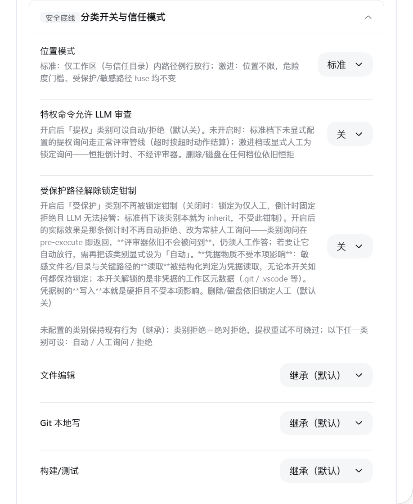
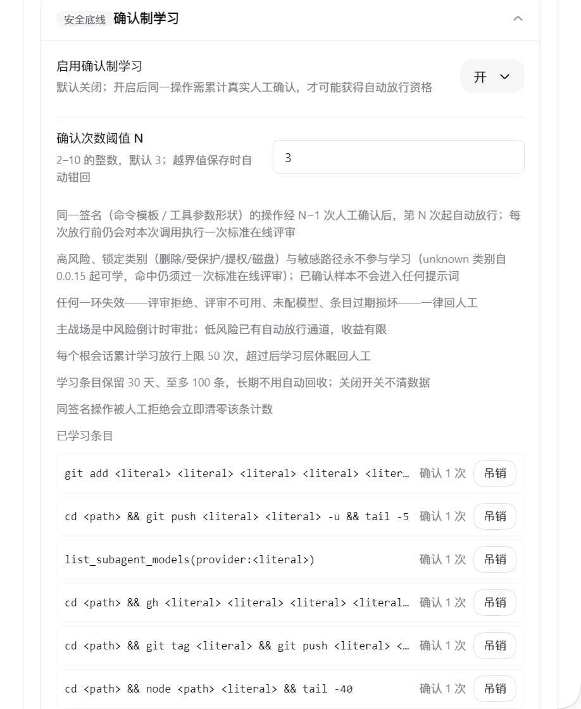

# @quill507/dsh-auto-approval-llm

> LLM-assisted auto approval with a timeout fallback for DeepSeek Harness's **Auto permission preset**.

`Auto` = `sandbox: danger-full-access` + `approval: ask`. This plugin is the **single terminal decision-maker** for `approval/request` inside Auto sessions: routine operations pass through static rules directly, risky/ambiguous ones go through the automatic pipeline `static rules → LLM classifier → LLM/human decision → countdown fallback → breaker` for a decision, with human and audit fallbacks kept throughout.

> 🖥️ **Platform support**: primarily developed and tested on **Windows + Git Bash**; feedback from macOS / Linux / WSL is welcome (see [Platform support](#platform-support)). **Android-browser access collects UI feedback only, with no support promise; the Auto preset is not supported in Android-native environments** (Termux / root / adb / shizuku and the like).

---

## Features

- **Static rules + LLM classifier**: read-only / session / workspace routine operations pass directly; dangerous, external-write, credential-exfiltration and protected-path operations are denied directly; ambiguous ones go to the LLM pre-classifier (`tools/guard` + `tools/pre-execute`).
- **Write-vector integrity hardening**: command segments carrying a real file write redirect (`>`/`>>`/`>|`/`&>`) leave the read-only fast path; the build/test and version-probe fast paths stay only for discard sinks or in-workspace routine targets (also under aggressive/trustedDirs broadening); the POSIX five heads `tee`/`dd of=`/`sed -i`/`truncate`/`install` join the per-target operand gates — writes to plugin runtime-state files are unconditionally hard-denied.
- **Tri-state switches for 11 categories + trusted-directory mode**: tools and shell commands are grouped into 11 categories (fileEdit / gitLocal / build / readOnly / delete / protected / privilege / networkExec / gitPush / publish / disk), each configurable in the settings card as `auto` / `ask` / `deny`; **the default is `inherit` for all — zero behavior change**. The dangerous categories (delete / protected / disk, plus privilege while its opt-out is off) are LOCKED to `ask` only — misconfiguring them as `auto`/`deny` is clamped away with a warning; **`privilegeAutoReview` and `protectedAutoReview` (both off by default) unlock privilege and protected respectively** — unlocking makes that category's locked ask answerable by the reviewer (an unconfigured protected call becomes an ordinary ask rather than a silent allow; privilege keeps its existing shape); protectedAutoReview's reach includes **reads** of credential trees (their writes stay hard-denied), so confirm that matches your expectations before enabling it; **LOCKED asks carry a hard-reject countdown** — they auto-reject on timeout and no `timeoutAction` setting can ever auto-allow them (unattended sessions no longer hang). `trustedDirs` extends routine locations to explicitly trusted directories in `standard` mode, while `categoryMode: aggressive` drops the location whitelist entirely — any location counts as routine (the sensitive-name fuse, runtime-state hard-deny, symlink re-check and every other danger gate stay untouched); compound commands merge strictly along "category enum order + directive severity"; a category denial is terminal, same as the denyList (privilege re-escalation cannot bypass it); every category decision lands in history / audit (`category-allow` / `category-deny` sources).
- **Online review model (optional)**: fill in the API protocol, base URL, model and key, and approval review hits your OpenAI / Anthropic-compatible endpoint directly; the key lives in DSH's credential store — the frontend only shows "Configured" and never echoes it. The direct trio (base URL / model / key) must be complete before direct review engages — save and test-connection run a client-side pre-check that blocks incomplete entries, and a legacy half-configured endpoint is treated as unconfigured at runtime so review follows the session model (still fail closed).
- **Human countdown + timeout fallback**: low/medium/high countdowns (default 5/8/10 s); on timeout the action follows `timeoutAction` (`Reject` / `Allow` / `Auto-approve low-risk`). Closing the browser never hangs (the host timer is authoritative).
- **LLM takeover**: for medium risk, if the LLM returns a decisive verdict within the countdown, the client follows it immediately — no click needed.
- **Breaker**: after `maxConsecutiveDenials` consecutive or `maxTotalDenials` cumulative LLM denials → hand to a human with no auto-countdown; `/approval-reset` can reset it.
- **Reliable history & audit**: in-memory window of 200 records + `history.jsonl`; append-only `audit.jsonl` (clear leaves a tombstone).
- **LLM response-time stats**: the "Recent approval history" sub-card shows min/avg/max real response times for the latest 100 LLM reviews (seconds) plus a separate "timed out / no response" count — timeouts and interruptions never pollute the average; persisted in `llm-latency.jsonl` (1 MB rotation).
- **Automatic LLM review retry**: transient gateway failures (rate-limit 429 / server 5xx / transport hiccups / empty responses; the LOW sync path also includes review timeouts) retry once automatically. Retries only run inside the leftover approval window — the first attempt keeps the original timeout semantics and never eats into the countdown — and honor the server's `Retry-After`; auth/config-class errors (401/403, NO_ADAPTER, …) never resend the request body or credentials; when retries are exhausted the outcome still fails closed (human / `timeoutAction` fallback). The per-attempt failure trail lands in `history.jsonl` / `audit.jsonl` (`attempts` field) and the latency stats.
- **Per-session review mode**: `/approval-mode manual|smart|unattended` persisted; `manual` always asks a human, `unattended` auto-answers; **high-risk timeouts still go to a human / fail closed**.
- **Declarative rules**: `rulesText` uses Claude-style `Tool(pattern) | allow|deny|human [| field]`, validated live. Dimension prefixes narrow a rule to an agent identity or workspace: `[agent:main]` / `[agent:!subagent]` / `[workspace:D:/proj]` (comma = AND). Rules are evaluated only for tool calls that enter the approval chain — statically auto-allowed routines bypass them; a parse error voids the **whole** rulesText (fail-open direction, flagged in the settings card).
- **Context-enhanced review (optional, off by default)**: with `reviewerContextFacts` on, the LLM review input gains structured workspace facts — target path existence/kind/size (read-only metadata, content is never read) plus this session's recently created files (up to 8, workspace-filtered and secret-redacted). Boundaries: out-of-workspace targets report existence/kind only (size is always null); a workspace symlink/junction resolving outside omits the whole facts block; temp-root files never enter recent_creates; any probe failure omits the whole block (fail closed); with the flag off the review payload stays byte-identical to previous releases.
- **Edit-diff preview (off by default)**: with `editDiffPreview` on, edit-class tools (`write` / `edit` / `str_replace_editor` non-`view` / `apply_patch`) entering human approval show a line-level red/green diff of the target file in the approval panel (del red/left-bar, add green, ctx gray; multi-line blocks collapse by default). Display-only: it never touches any decision path, never enters the LLM review input (the reasoning-blind invariant is unaffected) and any failure omits the block automatically (fail closed). Boundaries: readable in-workspace non-protected targets diff against their current content; whole-file writes (`write` / `str_replace_editor` `create`) with an unreadable target (out-of-workspace / protected / new file) preview a pure-addition diff of the new content only — the material comes entirely from the tool arguments, the target is never read, so external/protected old content can never surface; compare-class tools (`edit` / `str_replace` / `insert` / `apply_patch`) omit entirely when the target is unreadable. Targets ≤1 MiB (lstat without following + post-read byte re-check, junction/symlink escapes omitted); LCS input ≤1024 lines per side, lines >200 chars are ellipsized, output ≤200 lines and ≤32 KiB total with a `…truncated` marker line; semantics mirror the official tools (ambiguous edit/str_replace omitted, insert via the official 0-based splice, create on an existing file omitted, apply_patch covers every target in order and any patch failure omits the whole preview); countdown-marker literals inside the diff block are stripped so preview content can never forge or hijack the client auto-answer. Off by default.
- **Confirmation learning (optional, off by default)**: with `learningEnabled` on, an operation identified by a deterministic signature (command template / tool-argument shape, zero raw values) that you repeatedly approve manually in Auto sessions becomes eligible for automatic release once it reaches the threshold (`learningThreshold`, default 3, clamped to 2–10); **every learned release still runs one standard online review of the actual call first** — anything but a clean ALLOW (or carrying a CRITICAL contradiction) slides back into the ordinary human branch. Boundaries: only low/medium risk is learnable; high risk, the four LOCKED categories (delete/protected/privilege/disk) and sensitive paths never participate; unknown categories are learnable since 0.0.15 (a hit still runs one standard online review); commands containing variables/globs/quotes or dangerous heads (`tee`/`dd`/`sed`/`truncate`/`install`) are neither learned nor matched; a manual denial resets that signature's count immediately; up to 50 learned releases per root session (an audit alert lands on the very release that reaches the cap); entries live 30 days, at most 100, isolated per workspace; any failure anywhere is treated as "no hit" and falls back to the human path; the settings card's "Learned entries" block lists each entry (key hash and skeleton only, never signatures or raw values) and can revoke one immediately (audited).
- **Native-looking settings card**: 7 collapsible sub-cards (Timers & breaker / Safety rules list / Category switches & trust mode / Confirmation learning / Utility features / Online review model / Recent approval history), a top-level "Review & takeover preset" single-select (Standard / Conservative / Strict / Custom) that writes the LLM-participation gate pair in one click, the three lists merged into a tabbed "Precise lists" editor, countdown tiers and the two breaker thresholds each condensed to one row; top-level switches save instantly, each card has independent Save/Discard; illegal config values show a red banner with a "Try to fix" button.
- **Single-protocol DSH wiring (0.0.16+)**: the client auto-answer uses the DSH 0.1.5-rc.2+ (single-protocol contract line, floor raised as the host moves on) `uiSession.pendingInteractions` + `PendingApproval.answer` delivery protocol; the 0.1.1-rc.2 `snapshot.pending` compatibility adapter has been removed.

---

## How it works

```
Tool call
  → tools.guard        static hard-deny gate (hit = reject, no popup)
  → tools/pre-execute  static assessment + category-switch tightening: allow / deny / ask (human or LLM classifier)
  → approval/request   single terminal decision:
       rulesText → denyList → category-deny → allowlist → humanOnlyList →
       category-ask → review mode → breaker check → policy hard-deny →
       learned-allow (a hit still passes one standard online review) → risk tier (LOW/MEDIUM/HIGH) → LLM review + countdown
  → tools/post-execute feeds "timeout / rule / model denial" markers back
```

- **LOW**: silent pass when not reviewed; with review, decided directly by the LLM verdict (ALLOW/DENY); ESCALATE goes to a human.
- **MEDIUM**: shows the panel with a countdown while the LLM reviews in parallel; if `llmTakeoverScope` covers it and the LLM is decisive → follow immediately; otherwise it's advice only.
- **HIGH**: shows the panel with a countdown; the LLM only advises; on timeout it strictly follows `timeoutAction` (even under unattended, a HIGH timeout still goes to a human / fails closed).
- **Automatic LLM review retry**: a review request that hits a transient failure (429 / 5xx / transport / empty response, etc.) retries once; retries are bounded by the leftover approval window (they never eat into the countdown), honor `Retry-After`, and auth/config-class errors never resend credentials; the failure trail is recorded in the `attempts` audit.
- Every "needs a human" case delegates to the official panel for the countdown; **the timeout marker is written only by the host timer** — the client only reports an outcome, so it cannot be forged.

---

## Platform support

| Platform | Status | Notes |
|---|---|---|
| Windows (Git Bash) | ✅ primary dev/test environment | path decisions and shell parsing are developed and tested against this baseline |
| macOS / Linux / WSL | 🟡 not yet validated by real users | the code is cross-platform: paths are dispatched by syntax (posix vs win32), bash is the primary parser (pwsh branches run on Windows only), and the macOS `/tmp→/private/tmp` alias plus POSIX critical-path protection are pinned by contract tests (`tests/posix-platform.test.mjs`). Real-world feedback is welcome |
| Android browser access to dsh web | ⚠️ feedback only | UI experience of the settings card / approval panel on narrow viewports and touch screens can be reported, but **no support promise** (no phone-width adaptation of the official UI) |
| Android-native environments (Auto preset) | ❌ explicitly unsupported | Termux / root / adb / shizuku and similar environments differ too much (custom paths are rampant across Chinese Android vendors); the Auto preset there is a hobbyist experiment at best |

**Feedback**: report at [GitHub Issues](https://github.com/cuddly-guacamole/dsh-auto-approval-llm/issues) with the platform, dsh version, plugin version, the exact command, and the expected behavior.

---

## Installation

Published to npm (`@quill507/dsh-auto-approval-llm`) — install directly:

```bash
dsh plugin --profile web add @quill507/dsh-auto-approval-llm
```

Local development build / injection:

```bash
npx tsc -p tsconfig.json   # compile host → lib/
npx tsdown                 # build client bundle → lib/client.js
```

With the repo loaded in a web profile as a `link:` dependency: host changes take effect after recompiling and restarting dsh; client changes are hot-delivered after rebuilding.

> Note: the plugin depends on DSH's `auto` permission preset (`danger-full-access` + `approval: ask`) and is the single terminal for `approval/request` — **do not enable it together with other approval plugins** (e.g. dsh-approval-llm / dsh-auto-review).

---

## Quick start

1. Make sure the session/preset is on the **Auto** preset.
2. Open Settings → Plugins → Auto Approval and configure as needed; defaults work out of the box (empty config = static rules + session-model review + reject-style timeout fallback).
3. To route approval through your own model: in the "Online review model" card fill in protocol / API base URL / model name / API key → Save → Test connection.
4. If medium-risk popups are too frequent or timeouts slip through: raise "Medium-risk countdown", or set "Timeout action" to `Reject` / `Auto-approve low-risk`.

> 📚 Detailed documentation site: <https://cuddly-guacamole.github.io/dsh-auto-approval-llm/>

---

## Screenshots

Used under the Auto permission preset (`Settings → General settings → Permissions → Auto`; Read Only / Workspace Write / Auto / Full access):


Settings card overview — top-level switches save instantly, collapsible sub-cards below:


Timers & breaker — three countdown tiers, breaker anti-hijack and both breaker thresholds:


Online review model — API protocol / base URL / model / key (the key is never shown in the frontend):


Safety rules — safety prompt / allow & deny lists / declarative rules / dry-run:


Category switches & trust mode — standard/aggressive location modes, a switch to let privilege commands into LLM review, and per-category three-state overrides:



Confirmation-based learning — after N real human confirms of the same signature the action auto-passes (each pass still goes through one online review); learned entries can be viewed and revoked:



Approval panel — the countdown sits on the button that will auto-execute on timeout (here `timeoutAction=low-risk-allow` → a medium-risk request auto-**rejects** on timeout, so "Reject" runs the countdown and "Allow once" stays clean):


Session approval stats — the "Auto Approval" header-button popup: totals / allowed / rejected / timeout / breaker + recent records:


---

## Configuration

| Key | Default | Description |
|---|---|---|
| `enabled` | true | Master switch |
| `autoSwitchPolicyToAsk` | false | Flip `never` to `ask` for the auto preset with override=never (patched to true at install); configurable in the settings card (top-level switch, saves instantly) |
| `timeoutAction` | `reject` | Timeout action: `reject` / `allow` / `low-risk-allow` (auto-approve only LOW). Locked categories are exempt: delete / protected / disk (and privilege while the privilege opt-out is off) always auto-reject on timeout |
| `llmReviewScope` | `low-or-above` | Which tiers (LOW/MEDIUM/HIGH) are sent for LLM review |
| `llmTakeoverScope` | `medium-or-below` | Which tiers allow the LLM verdict to take over directly (values `low` / `medium-or-below` / `high-or-below`; the schema accepts `high-or-below`, but it behaves identically to `medium-or-below` — the HIGH branch never hands control to the LLM, high risk always lands on a human, so picking it does not buy HIGH automation) |
| `defaultReviewMode` | `smart` | Default per-session review mode: Manual / Smart / Unattended |
| `lowRiskSeconds` / `mediumRiskSeconds` / `highRiskSeconds` | 5 / 8 / 10 | Countdown seconds per tier |
| `breakerAntiHijackMs` | 0 | Disable breaker panel buttons for this many ms; 0 disables; configurable in the settings card (Timers & breaker) |
| `maxConsecutiveDenials` | 3 | Consecutive LLM-denial breaker threshold; 0 off |
| `maxTotalDenials` | 20 | Cumulative denial breaker threshold; 0 off |
| `classifierSource` | `session` | Fast-decision lane model source: `session` (follow the conversation) / `preset` (DSH-configured model, with `classifierProvider`+`classifierModel`) / `endpoint` (shared custom endpoint, no longer maintained) |
| `classifierProvider` / `classifierModel` | ''/'' | Fast-decision DSH preset model (required pair when `classifierSource=preset`) |
| `reviewerSource` | `session` | Deep-review lane model source: `session` / `preset` (with `reviewerProvider`+`reviewerModel`) / `endpoint` (shared endpoint) |
| `reviewerProvider` / `reviewerModel` | ''/'' | Deep-review DSH preset model (required pair when `reviewerSource=preset`) |
| `reviewerReasoning` | '' | Deep-review reasoning effort for host-route models: `''` follows the adapter default; explicit values (off/minimal/low/medium/high/xhigh/max) are forwarded as the dsh reasoningEffort — a model that does not support it fails loudly, never silently |
| `reviewerMaxTokens` | 2048 | Deep-review output cap (tokens, clamped 256–16384) |
| `classifierReasoning` | '' | Fast-decision reasoning effort (same semantics as `reviewerReasoning`) |
| `endpointUrl` / `endpointModel` / `endpointProtocol` | ''/''/`openai` | Shared custom endpoint (both lanes' `endpoint` source): OpenAI/Anthropic-compatible URL/model/protocol. Local mock and self-hosted services connect through it; without a resolved key the review fails closed rather than silently falling back |
| `safetyPrompt` | '' | Extra policy appended to the review model (hot-applied after save) |
| `allowlist` / `denyList` / `humanOnlyList` | [] | Exact tool-name match |
| `rulesText` | '' | Declarative rules (take precedence over the built-in lists; optional `[agent:…]` / `[workspace:…]` dimension prefix, comma = AND; parse error voids the whole text) |
| `rulesDryRun` | false | Dry-run: log rule hits without enforcing; configurable in the settings card (Safety rules list) |
| `maxArgsChars` | 4000 | Max length of recovered tool arguments |
| `notifyUser` | true | "Model approved" notice into the session |
| `showSessionPanel` | `off` | Session-header button: Off / Auto only / On |
| `aiButtonPosition` | `header` | Button position: header / floating |
| `workspaceRoot` / `dshHome` / `tempRoots` | ''/''/[] | Path roots (DSH_HOME is protected by default) |
| `classifierTimeoutMs` / `classifierMaxOutputTokens` | 8000 / 1024 | Classifier timeout and output cap |
| `reviewMaxRetries` | 1 | Extra review attempts after a failed review (0 single-shot / 1 default / 2 max; transient failures only — rate-limit, 5xx, transport, empty response, LOW-sync timeouts — bounded by the approval-countdown remainder; auth/config errors never retry) |
| `autoModeNoticeEnabled` | true | Injects an English context notice to the agent on entering/leaving the auto approval mode (independent switch) |
| `onboardingMessageEnabled` | true | Injects a one-time English onboarding message to the agent in the first Auto session (context notice, not a user banner); once off it is never injected again |
| `reviewWaitSeconds` | 5 | Per-attempt LLM review wait time (s, 1–10); raise it when the official channel's TTFB is slow; recommended not to exceed the low-risk countdown |
| `debug` | false | Debug mode: writes `approval-debug.jsonl` and `[debug]` logs |
| `redactResults` | false | When on, successful tool results also pass through the redactor before being fed back to the model (post-execute side) |
| `reviewerContextFacts` | false | YAML only — no settings-card control. Context-enhanced review: attach structured workspace facts (target existence/kind/size + up to 8 session-created files) to the LLM review input; off by default (payload stays identical to previous releases). Boundaries: out-of-workspace targets report existence/kind only, never size; temp-root files never enter recent_creates; any probe failure omits the whole facts block |
| `editDiffPreview` | false | Edit-class tools (write/edit/str_replace_editor non-view/apply_patch) entering human approval show a line-level red/green diff of the target file in the approval panel. Display-only: never part of any decision or of the LLM review input; omitted automatically on any failure. Boundaries: readable in-workspace non-protected targets diff against current content; whole-file writes (write/create) with unreadable targets preview a pure-addition diff of the new content only (target never read); compare-class tools omit when unreadable; targets ≤1 MiB (lstat without following + post-read byte re-check, junction escapes omitted); LCS ≤1024 lines/side, lines >200 chars ellipsized, output ≤200 lines and ≤32 KiB (truncated marker `…truncated`); official semantics mirrored (ambiguous/existing/out-of-range → omitted); countdown literals inside the diff block are stripped |
| `rejectGuidance` | false | Rejection guidance: when a tool call is rejected, the agent gets a short whitelist-only note (source/category enums — never tool names or free text) to cut blind retries. Off by default = zero behavior change. Fires on rule/denyList/category denials and the official "user rejected tool" shape; per-call dedup plus a 5/60s rate cap; fail-closed, injection never disturbs the approval path |
| `maintenanceDshPaths` | [] | Host-only key: DSH_HOME subtrees for operator maintenance (absolute paths). Inside them the guard's DSH_HOME hard-deny is relaxed for NON-runtime-state files only (skills, profiles, docs); every plugin runtime-state basename (history/audit/learning…) stays hard-denied, shell write vectors stay hard-denied, and the fenced trees (sessions/plugins/credentials*) can never be named. Patch/YAML only |
| `categoryPolicy` | `{}` | Tri-state switches for 11 categories: `{category: auto\|ask\|deny}`, missing = `inherit` (previous behavior); delete/protected/disk (and privilege/protected while their unlock key is off) are LOCKED to `ask` (other values warn + dropped); harnessInternal/unknown have no key and cannot be configured |
| `categoryMode` | `standard` | Trusted-directory mode: in `standard`, routine locations = workspace ∪ `trustedDirs`; `aggressive` removes the location whitelist so any location counts as routine (the sensitive-name fuse, runtime-state hard-deny, symlink re-check and other danger gates stay untouched; the UI states what is opened when switching) |
| `privilegeAutoReview` | false | Unlocks the privilege category clamp (off by default = fail closed): privilege can then be set to auto/ask/deny and flows through the classifier + LLM review + countdown pipeline; delete/protected/disk stay locked |
| `protectedAutoReview` | false | Unlocks the protected category clamp (off by default = fail closed): an unconfigured protected call stops being pinned to an automatic reject and becomes a standing human ask instead — a category ask returns in pre-execute, so the **reviewer is still never asked** and a human must answer; set the category to `auto` explicitly to auto-allow it. **Credential material is unaffected**: reads of sensitive names/trees and of critical paths — including the read source of a write head such as `cp` / `tee` / `dd` — are flagged as credential reads and stay locked with this switch on, so only non-credential workspace metadata (`.git`, `.vscode`, …) is unlocked. Writes into credential trees stay hard-denied either way. The floor is scoped by the category layer: an opaque line (containing `(` / `{` / `$(` / a here-document) is `unknown`, so it is neither unlocked nor floored; shell commands now get a symlink-escape re-check too (see docs/03 §3.4: only escapes onto credential trees, `DSH_HOME` or the runtime state are hard-denied, while a plain external landing spot keeps its previous behaviour) |
| `trustedDirs` | [] | Host-only key: extra trusted directory roots (array of absolute paths) — members of the `standard`-mode location whitelist and of the symlink re-check zone shared by both modes; credential/home/dshHome/critical paths are excluded; patch/YAML only — card saves won't wipe it |
| `trustedDshSubpaths` | [] | Host-only key: DSH_HOME subtrees an Auto session may write (array of absolute paths). Empty by default = the whole DSH_HOME tree stays hard-denied (consistently across `edit`/`write`/`apply_patch`/`str_replace_editor`); a listed subtree gets the same allow as the plugin's own development zone. Patch/YAML only. Entries are dropped with a warning when they are not absolute, sit outside DSH_HOME, name DSH_HOME itself, cover `sessions`/`plugins`/`credentials*`, or normalize into a critical tree. **Know before enabling**: skill files are injected into the agent's context as instructions, so opening `skills` lets the agent durably rewrite its own constraints. The plugin's runtime-state hard-deny (history/audit/learning…) is orthogonal and unaffected |
| `directHumanEnabled` | false | Direct-human channel: the agent may call `dsa_request_user` to route a follow-up operation to a human instead of the LLM classifier. Off by default = zero behavior change. The tool is REGISTERED only when the switch is on at boot (tool sets are not hot-swappable — enabling needs a restart); the answerer and execute checks read the switch live, so turning it off stops the channel at once |
| `slashCommandsEnabled` | false | Registers `/approval-mode` `/approval-reset` `/approval-reset-all` in the command palette (review-mode show/set + breaker reset). Off by default = zero command surface. Command sets are not hot-swappable — they are REGISTERED only when the switch is on at boot (enabling needs a restart); every handler reads the switch live, so turning it off stops the already-registered commands at once |
| `learningEnabled` | false | Confirmation learning: an operation approved manually enough times gets auto-released (a hit still passes one standard online review); off by default = zero behavior change. High risk / LOCKED categories / sensitive paths never participate (unknown is learnable since 0.0.15); max 50 learned releases per root session |
| `learningThreshold` | 3 | Manual confirmations required before a learned release (clamped to 2–10 on save); a manual denial resets that signature's count |

> Top-level switches (enable / timeout action / review & takeover scopes and the flip-never-to-ask switch / default mode / auto-mode switch notice / session panel & button position) save instantly; each sub-card has independent Save/Discard buttons (the Safety rules card also has Restore defaults). Host-only keys (workspaceRoot etc.) are configured via patch/YAML; card saves won't wipe them.

---

## Review modes and commands

> The commands below are NOT registered by default: enable "Register /approval-mode /approval-reset /approval-reset-all commands" in the settings card (`slashCommandsEnabled`) and restart to get them in the palette; turning the switch off live disables the already-registered commands at once.

- `/approval-mode` — show the current session review mode
- `/approval-mode manual|smart|unattended` — set it (persisted)
- `/approval-reset` — reset breaker counters and in-flight approval state (session-scoped)
- `/approval-reset-all` — reset breaker counters and in-flight approval state across sessions

---

## Data files (canonical location: `<DSH_HOME>/auto-approval-llm/`)

All six files are canonically located in the `auto-approval-llm/` directory under `DSH_HOME` (default `~/.dsh`), created on demand by the plugin. This is deliberately **outside the installed package**: an npm upgrade replaces the whole package directory, so state kept inside it is deleted on every version change.

- **Reads** prefer the canonical directory and fall back to the legacy package-root file (where shipped releases wrote) when that copy is absent. While the canonical directory is usable the canonical copy wins, so a stale copy can never shadow live data; **once writes degrade to the package root, the NEWER of the two copies wins** (records go to the legacy copy, which the degradation seeded from the canonical one, and a later boot with a usable canonical directory carries it back). A timestamp is trusted only while the two copies are verified to contain one another (byte prefix for append-only files, entry coverage for the overwrite-style stores), and the check always runs before any write; when it fails, the canonical copy is kept, both copies are preserved and a warning is printed.
- **Writes** go to the canonical directory; when it cannot be created, **or when it exists but refuses writes** (caught by a boot-time real write probe and by the write-failure ladder), they fall back to the package root (with a one-time-per-process `console.warn`) instead of failing. The audit is the fail-closed commit gate (`appendAuditLine` returning false turns verdicts into rejections), so an unusable path must not make every verdict unauditable. Relocation happens only for "this location refuses writes" errors (`EACCES`/`EPERM`/`EROFS`/`EISDIR`/`ENOTDIR`) and is sticky; errors that may already have moved bytes (`ENOSPC` and friends) keep failing closed. Directory usability caches success but is re-checked on every resolution, so deleting it while the host runs is detected and it is recreated instead of the read and write paths diverging.
- **Migration is automatic**: no manual file move. Append-only files (history/audit/approval-debug/llm-latency) copy their legacy content into the canonical directory atomically, through a temp file, before the first write; overwrite-style stores (learning/review-mode) already persist the whole in-memory state loaded through the read rule.
- **Protection is stronger**: the canonical directory sits under `DSH_HOME`, where the guard denies writes outright — not only for these six basenames — while reads still produce a `runtime-state-read` observation event.
- **The migration code has a retirement date**: the fallback and automatic migration are a one-way bridge for older installs and are planned for removal three releases after this change — i.e. once the version reaches 0.0.25 — leaving only the canonical directory.
- **No manual step is required.** An install whose files still sit in an older layout keeps reading them until the first write migrates them forward; the old copies are then left in place and can be deleted by hand.

| File | Meaning |
|---|---|
| `history.jsonl` | Approval history (in-memory window of 200 + on-disk; rotates >1 MB). Deleting the file neither reloads nor clears the memory window; the next decision recreates it |
| `audit.jsonl` | Append-only audit: `decision` records + a `clear` tombstone + non-decision observation events (`result-redacted` / `mask-failed` / `learning-*` / `rules-context-missing` / `rules-parse-error` / `runtime-state-read` / `permission-change` and others) |
| `review-mode.json` | Per-session review-mode snapshot |
| `llm-latency.jsonl` | Real LLM review/classify response-time stats (latest 100 MIN/AVG/MAX; rotates >1 MB) |
| `approval-debug.jsonl` | Written only when debug mode is on: review/approval timeline (decision/risk/tookMs/outcome/source), rotated >1 MB |
| `learning.json` | Confirmation-learning entries: SHA-256 signature keys + redacted template skeletons; 30-day TTL / max 100 entries evicted by last use, atomic tmp+rename writes, isolated per workspace (turning the switch off keeps the data) |

Query: `node scripts/audit-query.mjs [--last N|--tool X|--session S|--source S|--since ISO|--json]`

Friction report (read-only): `node scripts/friction-report.mjs [--file <audit.jsonl>] [--latency <llm-latency.jsonl>] [--since ISO] [--window N] [--json]` — summarizes the panel-mediated rate (LLM takeovers included), how many answers a human gave, the countdown-settled rate, rejection sources, the cross-tab of human answers against the LLM verdict in hand, and how each review lane settled. It also evaluates the unattended-window criterion over the last N sessions (by last activity) and prints `PASS` / `FAIL` / `VACUOUS` / `INSUFFICIENT` with exit codes 0/1/2/3. A window with no LLM verdict to overturn reports `VACUOUS`, never a pass.

---

## Security design

- **Single terminal**: one decision-maker per approval (prepend + global), avoiding double popups / double writes / broken audit.
- **Fail-closed**: reviewer timeout/garbage/failure → reject or hand to a human; ESCALATE always goes to a human and is never auto-allowed by `timeoutAction=allow`; reviewer failure doesn't count toward the breaker.
- **Reasoning-blind**: the reviewer sees only the tool identity, structurally sanitized arguments, bounded direct user messages (the sole authorization evidence) and workspace facts — reviewer prose and tool output are stripped.
- **Key never leaves the host**: the online-review key lives in DSH credentials, resolved per operation; the frontend only shows "Configured".
- **Countdown button rule**: the countdown is attached only to the button that will auto-execute on timeout — `timeoutAction=Allow` → auto-approve, "Allow once" counts down and Reject stays clean; `timeoutAction=Reject` / `Auto-approve low-risk` → medium/high risk auto-reject on timeout, "Reject" counts down (with low-risk-auto-approve, only low risk auto-passes). The medium-risk default of 8 s is tight — raise it as needed.
- **Diff preview lives only in the human panel**: the edit-diff text is appended only to the ask reason (visible to the human panel) — it never enters the review payload / REVIEWER_SYSTEM (reasoning-blind), never enters history/audit; countdown literals inside the block are stripped before injection and the client parses only the post-hide text, so it can never alter any auto-answer path. Protected/secret files (`.env` etc.) are never read for old content (compare-class tools omit entirely; whole-file writes preview only the new content from the tool arguments, so external/protected old content never surfaces); their old content persists in the session approval/asked log like the tool arguments do (official contract is log-only, invisible to the model context — the same exposure class as the existing arguments).
- **Guard-fuse denials are audited**: a `tools/guard` hard-deny or symlink-escape refusal first records a `decision` row with `source: guard`, `outcome: rejected` (reason carried) and then rejects the call — a failed audit write never softens the denial (the call stays refused).
- **rulesText parse errors are loud**: on both planes (pre-execute and answerer) a parse error logs via `console.error` + debugLog and lands a deduplicated `rules-parse-error` audit event — declarative rules no longer lapse silently.
- **Runtime-state reads are audited by default**: reading the plugin's runtime-state files (history/audit/learning… — structured read tools such as read/grep plus shell readers) appends a default-on `runtime-state-read` non-decision audit event; purely observational, it never denies or changes any verdict.

---

## Acknowledgements

This project references or derives from the following open-source projects — thanks to their authors and communities:

- **[@nanmicoder/dsh-auto-mode](https://github.com/NanmiCoder/dsh-auto-mode)** — the core auto-approval pipeline (Auto preset + static rules → LLM classifier → human): protected paths, static assessment, shell safety parsing and LLM pre-classification were ported and re-implemented independently in `src/auto/` (the project works fine without it).
- **[@anionex/dsh-vision-toolkit](https://github.com/Anionex/dsh-vision-toolkit)** — the settings UI patterns: online model fields (API protocol / base URL / model / key, with the key stored in DSH credentials and never shown in the frontend), the red error banner with a fix button, and the "reuse DSH native CSS and UI primitives" approach.

---

## Version / publishing

- Install: `dsh plugin --profile web add @quill507/dsh-auto-approval-llm`
- License: BSD-3-Clause.
