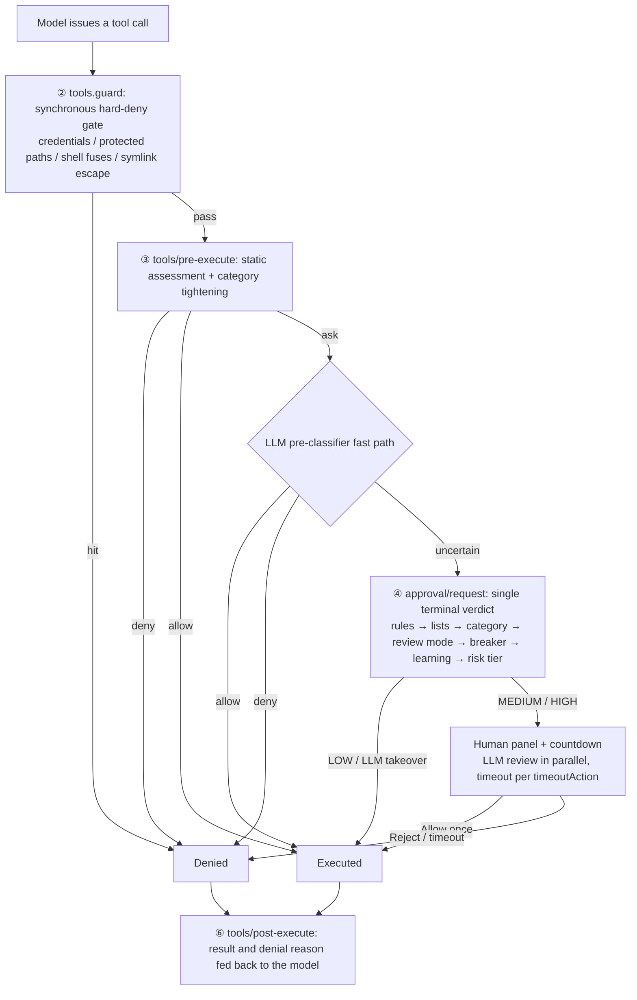

<div align="center">

# @quill507/dsh-auto-approval-llm

**LLM-assisted auto approval with a timeout fallback for the DeepSeek Harness Auto permission tier**

*Routine calls pass statically · risky or ambiguous ones go through LLM review + a human countdown · fail-closed by default*

[](https://www.npmjs.com/package/@quill507/dsh-auto-approval-llm)
[](https://www.npmjs.com/package/@quill507/dsh-auto-approval-llm)

[](https://opensource.org/licenses/BSD-3-Clause)
[](https://awesome-dsh-plugin.com)

[Docs](https://cuddly-guacamole.github.io/dsh-auto-approval-llm/) · [简体中文](https://github.com/cuddly-guacamole/dsh-auto-approval-llm/blob/main/README.md) · [Issues](https://github.com/cuddly-guacamole/dsh-auto-approval-llm/issues)

</div>

`Auto tier` = `sandbox: danger-full-access` + `approval: ask`. In Auto sessions this plugin is the **single terminal answerer** for `approval/request`: routine calls pass through static rules, while dangerous or ambiguous ones follow "static rules → LLM classifier → LLM/human verdict → countdown fallback → breaker", with human and audit fallbacks kept throughout.

---

## Features

1. **Static rules + LLM classifier** — read-only, session and workspace routine calls pass; dangerous calls, external writes, credential exfiltration and protected paths are denied; ambiguous calls go to the LLM pre-classifier.
2. **Write-vector hardening** — command segments carrying a real file-write redirect leave the read-only fast path; the POSIX heads `tee` / `dd of=` / `sed -i` / `truncate` / `install` join the per-target gate through their operands; direct writes to plugin runtime-state files are unconditionally hard-denied.
3. **Tri-state switches for 12 categories + trusted-directory mode** — each category is configurable as `auto` / `ask` / `deny`, and **every default is `inherit` = zero behavior change**; the dangerous categories (delete / protected / disk) are locked to `ask`; `trustedDirs` and `categoryMode` define what counts as a routine location. → [docs/17](https://github.com/cuddly-guacamole/dsh-auto-approval-llm/blob/main/docs/17-category-switches.md)
4. **Dual-channel model sources** — the fast classifier and the deep reviewer each pick their own source: the session model (default) / a DSH-configured model / a custom endpoint. Endpoint keys live in the DSH credential store; the frontend only shows "Configured" and never echoes them.
5. **Tiered countdown + timeout fallback + LLM takeover** — low/medium/high countdowns (default 5 / 8 / 10 s); on timeout the action follows `timeoutAction` (reject / allow / auto-approve low-risk); at medium risk an explicit LLM verdict inside the window takes over. Closing the browser never hangs (the host timer is authoritative).
6. **Breaker and loop guard** — consecutive or cumulative LLM denials hand the call to a human (`/approval-reset` resets); the **loop guard** (off by default) turns a call that the auto-allow surface keeps allowing into a pinned-reject countdown.
7. **Declarative rules `rulesText`** — `tool(regex) | allow|deny|human [| field]`, with `[agent:…]` / `[workspace:…]` dimension prefixes; a parse error invalidates the whole block (the settings card warns).
8. **Confirmation-based learning** (off by default) — once one signature has been confirmed by a human repeatedly, it auto-allows, **still running a standard online review before every allow**; entries can be viewed and revoked. → [docs/18](https://github.com/cuddly-guacamole/dsh-auto-approval-llm/blob/main/docs/18-confirm-learning.md)
9. **Edit-diff preview + reviewer context facts** (both off by default) — the approval panel shows a line-level diff of the target file, and the reviewer input can carry structured workspace facts. Both are display-only / read-only metadata and never enter any auto-answer path.
10. **Auditable and observable** — `history.jsonl` plus an append-only `audit.jsonl`; real LLM review latency statistics; one automatic retry on transient gateway failures (auth-class errors never resend credentials).

---

## How it works



- **LOW**: allowed silently when no review is due; otherwise decided by the verdict; ESCALATE goes to a human.
- **MEDIUM**: panel plus countdown with the LLM running in parallel; if `llmTakeoverScope` covers the tier and the verdict is explicit, it follows immediately.
- **HIGH**: panel plus countdown, with the LLM advising only; on timeout `timeoutAction` applies strictly.
- The timeout marker's only author is the host timer; the client only reports outcomes and cannot forge one.

> The full five-stage hook sequence (⑤ artifact registration, ⑦ notice delivery) is in [docs/02](https://github.com/cuddly-guacamole/dsh-auto-approval-llm/blob/main/docs/02-tool-call-lifecycle.md); the two static layers are consulted through the host `tools/pre-execute` waterfall, and the peer-shortcut shapes are in [docs/09](https://github.com/cuddly-guacamole/dsh-auto-approval-llm/blob/main/docs/09-defense-in-depth.md).

---

## Installation

**Prerequisites**: the session or preset is on the **Auto tier** (`danger-full-access` + `approval: ask`); DSH `0.1.5-rc.2`+; Node `^22.19.0 || >=24.0.0`.

```bash
dsh plugin --profile web add @quill507/dsh-auto-approval-llm
```

- **Restart dsh** after installing, so the host side takes effect.
- **Auto tier only** (other permission tiers are untouched); this plugin is the single terminal answerer for `approval/request` — **do not enable it alongside another approval plugin**.
- **Platforms**: Windows + Git Bash is the primary development and test baseline; macOS / Linux / WSL are adapted in code but not verified by real users; Android native environments are unsupported. → [docs/19](https://github.com/cuddly-guacamole/dsh-auto-approval-llm/blob/main/docs/19-platform-support.md)
- **Feedback**: please file a [GitHub issue](https://github.com/cuddly-guacamole/dsh-auto-approval-llm/issues) with your platform, dsh version, plugin version, reproduction command and expected behavior.
- Local development: `npx tsc -p tsconfig.json` plus `npx tsdown`, loaded through a `link:` dependency (host changes need a restart; client changes hot-reload). → [docs/14](https://github.com/cuddly-guacamole/dsh-auto-approval-llm/blob/main/docs/14-code-map.md)

---

## Quick start

1. Switch the session or preset to the **Auto tier**.
2. Open Settings → Plugins → Auto approval. **The defaults already work** (routine calls pass statically; ambiguous ones go to session-model review; on timeout `timeoutAction` applies, reject by default).
3. To route reviews through a specific model: set the channel's model source to "DSH model" in the Online review model card and pick one, or choose "Custom endpoint" and fill in protocol / base URL / model / key → save → test connection.
4. If panels feel too frequent: raise the medium-risk countdown, or set the timeout action to `Reject` / `Auto-approve low-risk`.

> **Session commands** (not registered by default): `/approval-mode` to inspect the current session mode, `/approval-mode manual|smart|unattended` to set it, and `/approval-reset` / `/approval-reset-all` to reset the breaker — enable `slashCommandsEnabled` in the settings card and restart.

---

## Screenshots


The remaining surfaces (timers and breaker / safety rules / category switches and trust mode / confirmation-based learning / online review model / permission preset) are documented in [docs/10 · Client UI](https://github.com/cuddly-guacamole/dsh-auto-approval-llm/blob/main/docs/10-client-ui.md).

---

## Configuration

The table below lists the common keys only; **every key, its full semantics and its adjudication exceptions are in [docs/12 · Configuration](https://github.com/cuddly-guacamole/dsh-auto-approval-llm/blob/main/docs/12-config.md)**.

| Key | Default | Description |
|---|---|---|
| `enabled` | true | Answerer master switch: off stops this plugin from settling approval/request (the static fuses and the guard still run) |
| `timeoutAction` | `reject` | Timeout action: reject / allow / low-risk only (delete and disk are always denied regardless of this key) |
| `llmReviewScope` | `low-or-above` | Which risk tiers go to LLM review |
| `llmTakeoverScope` | `medium-or-below` | Which tiers let an explicit LLM verdict decide directly |
| `lowRiskSeconds` / `mediumRiskSeconds` / `highRiskSeconds` | 5 / 8 / 10 | The three countdowns (seconds) |
| `defaultReviewMode` | `smart` | Per-session review mode: manual / smart / unattended |
| `maxConsecutiveDenials` / `maxTotalDenials` | 3 / 20 | Breaker thresholds (0 disables) |
| `loopDetectionThreshold` | 0 | Loop-guard threshold (0 = off; YAML only) |
| `rulesText` | '' | Declarative rules (`[agent:…]` / `[workspace:…]` prefixes) |
| `allowlist` / `denyList` / `humanOnlyList` | [] | Exact tool-name lists |
| `classifierSource` / `reviewerSource` | `session` | Model source per channel: session / preset / endpoint |
| `endpointUrl` / `endpointModel` / `endpointProtocol` | '' / '' / `openai` | Shared custom endpoint (no longer maintained, kept for compatibility) |
| `categoryPolicy` / `categoryMode` / `trustedDirs` | `{}` / `standard` / [] | Category tri-states, location mode and trusted directories |
| `privilegeAutoReview` / `protectedAutoReview` | false | Unlock privilege / protected respectively (differences in docs/17) |
| `learningEnabled` / `learningThreshold` | false / 3 | Confirmation-based learning switch and threshold (2–10) |
| `editDiffPreview` / `reviewerContextFacts` | false | Diff preview / reviewer context facts (YAML only) |
| `slashCommandsEnabled` / `directHumanEnabled` | false | Register `/approval-*` commands / direct-human channel (the agent can route a call to a human; both need a restart) |
| `debug` / `redactResults` / `notifyUser` | false / false / true | Debug log / redact successful results / approval notice in-session |

> The settings card is a set of collapsible sub-cards with immediate save for top-level switches, and invalid configuration values raise a red banner plus a "Try to fix" button → [docs/10](https://github.com/cuddly-guacamole/dsh-auto-approval-llm/blob/main/docs/10-client-ui.md). host-only keys (`workspaceRoot`, `trustedDirs`, `trustedDshSubpaths`, `maintenanceDshPaths`, `rulesDryRun`, `breakerAntiHijackMs`, `reviewMaxRetries` and friends) are configured through patch / YAML, and saving the settings card never clears them.

---

## Data files

Canonical location: `<DSH_HOME>/auto-approval-llm/` (**deliberately outside the plugin package directory** — an npm upgrade replaces the whole package directory).

| File | Semantics |
|---|---|
| `history.jsonl` | Approval history (200-entry memory window plus disk, >1 MB rotation) |
| `audit.jsonl` | Append-only audit: decisions, clear tombstones and non-decision observation events |
| `review-mode.json` | Per-session review-mode snapshot |
| `llm-latency.jsonl` | Real LLM response latency statistics (last 100, >1 MB rotation) |
| `approval-debug.jsonl` | Review/approval timeline, written only in debug mode |
| `learning.json` | Learning entries (SHA-256 signature key plus a redacted skeleton; 30-day TTL, per-workspace isolation) |

When the directory cannot be written, the plugin **fails closed**: the audit gate turns every verdict into a denial and prints a one-time warning; there is no fallback and no migration. Query with `node scripts/audit-query.mjs`; read-only friction report with `node scripts/friction-report.mjs`. → [docs/11](https://github.com/cuddly-guacamole/dsh-auto-approval-llm/blob/main/docs/11-data-persistence.md)

---

## Security model summary

- **Single terminal answerer**: one decision-maker per approval (prepend + global), so there are never two popups or two writes.
- **fail-closed**: reviewer timeout / garbage / failure → reject or hand to a human; ESCALATE always goes to a human and is never auto-allowed by `timeoutAction=allow`.
- **reasoning-blind**: the reviewer sees only the tool name, structurally sanitized arguments, bounded direct user messages (the sole authorization evidence) and workspace facts.
- **Keys never leave the host**: the online-review key lives in DSH credentials, is resolved per operation, and the frontend only ever shows "Configured".
- **The audit trail cannot be hand-edited**: append-only with tombstones on clear; even a `tools/guard` hard-deny is written to the audit before being rejected (a failed audit write never softens the denial).
- **The timeout marker's only author is the host timer**; the client only reports outcomes and cannot forge one.

---

## Known limitations

- **When a peer plugin short-circuits, neither static layer nor the guard is consulted**: if another plugin returns a non-decision object without a `reason` first in the `tools/pre-execute` waterfall, the host dispatches the call directly — the plugin has no way to self-check this at startup. → [docs/09](https://github.com/cuddly-guacamole/dsh-auto-approval-llm/blob/main/docs/09-defense-in-depth.md)
- **The loop guard is not a security boundary**: it only stops a stuck loop, and a slightly different argument bypasses it.
- **A `rulesText` parse error invalidates the whole block** (fail-open direction); the settings card warns but does not block saving.
- **With `protectedAutoReview` on and no explicit category policy**, a protected ask becomes an untimed human ask that **never settles on its own** — an unattended session will wait forever.
- **Credential material is unaffected by the unlock switches**: reading `.env` / `.npmrc` and similar stays locked even with `protectedAutoReview` on (stricter than needed, so it can over-deny).
- **Opaque lines** (compound commands containing `(` / `{` / `$(` / heredoc) fall into `unknown` at the category layer: they are neither unlocked nor covered by the credential-read floor, i.e. neither tightened nor relaxed.
- **Old content involved in a diff preview persists in plain text in the session approval/asked log** (the official contract is log-only, invisible to the model context).
- **Platforms other than Windows have not been verified by real users.**

---

## Credits

- **Code derivation**: [@nanmicoder/dsh-auto-mode](https://github.com/NanmiCoder/dsh-auto-mode) (MIT License) — the core approval pipeline was ported from that project and re-implemented independently in `src/auto/`; the MIT copyright and permission notice is retained in the source files and the compiled artifacts `lib/auto/*.js` and `lib/client.js`.
- **Design-pattern reference**: [@anionex/dsh-vision-toolkit](https://github.com/Anionex/dsh-vision-toolkit).
- **Mechanism references**: [@moon09300731/dsh-approval-gate](https://github.com/moon09300731/dsh-approval-gate) (confirmation-based learning), [@a903067276-rgb/dsh-perm-guard](https://github.com/a903067276-rgb/dsh-perm-guard) (category tri-states + trusted directories), [@PerryLink/dsh-permission-rules](https://github.com/PerryLink/dsh-permission-rules) (rule dimensions).
- **Contributors**: [@daveycodez](https://github.com/daveycodez), [@MikotoMyWife](https://github.com/MikotoMyWife).

---

## License

BSD-3-Clause ｜ [LICENSE](https://github.com/cuddly-guacamole/dsh-auto-approval-llm/blob/main/LICENSE)
