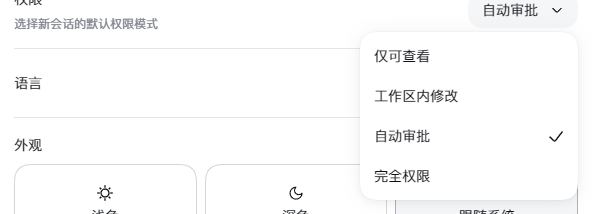
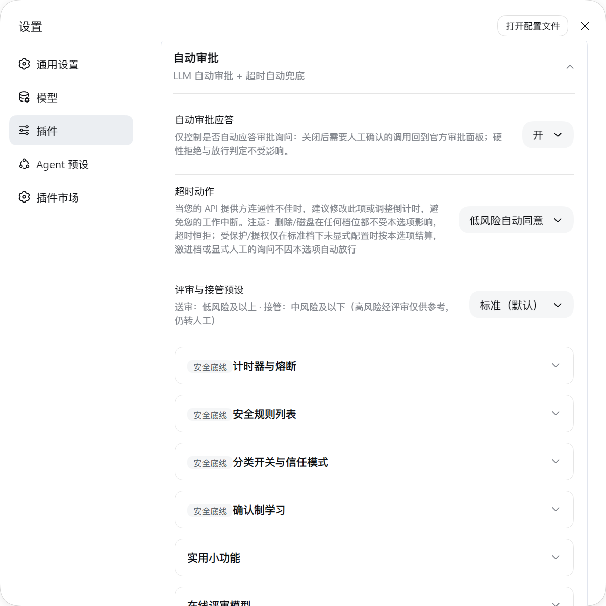
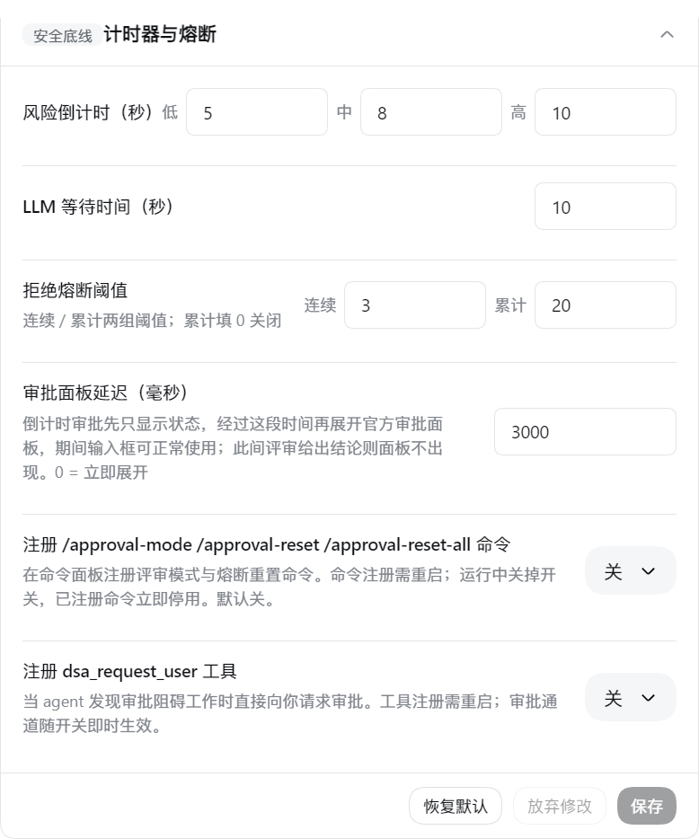
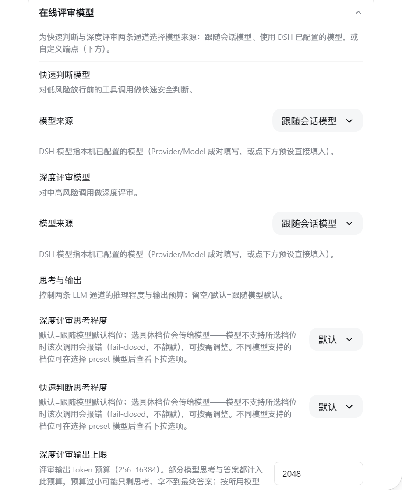
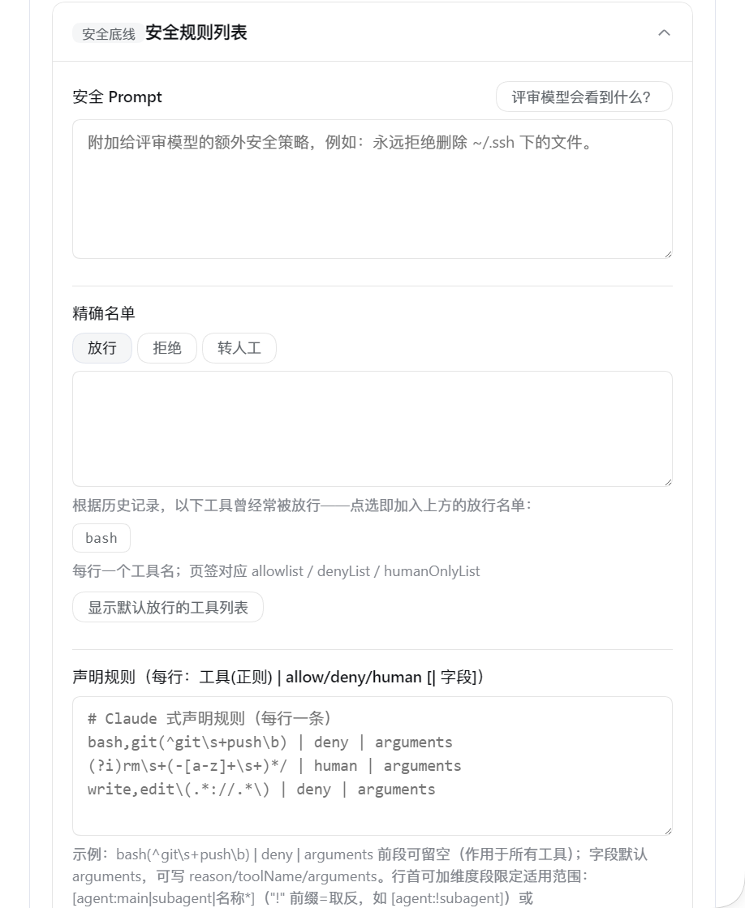
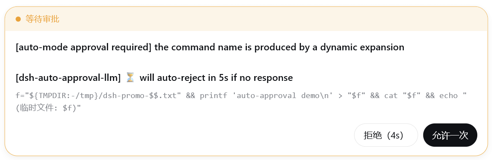
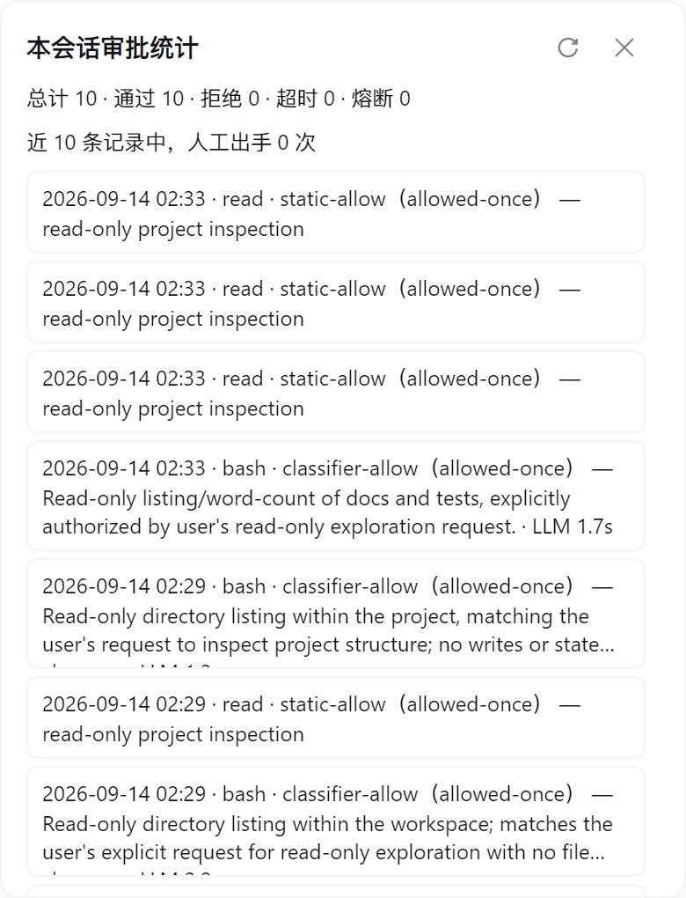

# @quill507/dsh-auto-approval-llm

> LLM-assisted auto approval with a timeout fallback for DeepSeek Harness's **Auto permission preset**.

`Auto` = `sandbox: danger-full-access` + `approval: ask`. This plugin is the **single terminal decision-maker** for `approval/request` inside Auto sessions: routine operations pass, risky/ambiguous ones go through the automatic pipeline `static rules → LLM classifier → LLM/human decision → countdown fallback → breaker`, maximizing "automatic yet safe" throughput while keeping human and audit fallbacks.

---

## Features

- **Static rules + LLM classifier**: read-only / session / workspace routine operations pass directly; dangerous, external-write, credential-exfiltration and protected-path operations are denied directly; ambiguous ones go to the LLM pre-classifier (`tools/guard` + `tools/pre-execute`).
- **Online review model (optional)**: fill in the API protocol, base URL, model and key, and approval review hits your OpenAI / Anthropic-compatible endpoint directly; the key lives in DSH's credential store — the frontend only shows "Configured" and never echoes it.
- **Human countdown + timeout fallback**: low/medium/high countdowns (default 5/8/10 s); on timeout the action follows `timeoutAction` (`Reject` / `Allow` / `Auto-approve low-risk`). Closing the browser never hangs (the host timer is authoritative).
- **LLM takeover**: for medium risk, if the LLM returns a decisive verdict within the countdown, the client follows it immediately — no click needed.
- **Breaker**: after `maxConsecutiveDenials` consecutive or `maxTotalDenials` cumulative LLM denials → hand to a human with no auto-countdown; `/approval reset` can reset it.
- **Reliable history & audit**: in-memory window of 200 records + `history.jsonl`; append-only `audit.jsonl` (clear leaves a tombstone).
- **LLM response-time stats**: the "Recent approvals" sub-card shows min/avg/max real response times for the latest 100 LLM reviews (seconds) plus a separate "timed out / no response" count — timeouts and interruptions never pollute the average; persisted in `llm-latency.jsonl` (1 MB rotation).
- **Automatic LLM review retry**: transient gateway failures (rate-limit 429 / server 5xx / transport hiccups / empty responses; the LOW sync path also includes review timeouts) retry once automatically. Retries only run inside the leftover approval window — the first attempt keeps the original timeout semantics and never eats into the countdown — and honor the server's `Retry-After`; auth/config-class errors (401/403, NO_ADAPTER, …) never resend the request body or credentials; when retries are exhausted the outcome still fails closed (human / `timeoutAction` fallback). The per-attempt failure trail lands in `history.jsonl` / `audit.jsonl` (`attempts` field) and the latency stats.
- **Per-session review mode**: `/approval-mode manual|smart|unattended` persisted; `manual` always asks a human, `unattended` auto-answers; **high-risk timeouts still go to a human / fail closed**.
- **Declarative rules**: `rulesText` uses Claude-style `Tool(pattern) | allow|deny|human [| field]`, validated live.
- **Native-looking settings card**: 4 collapsible sub-cards (Timers & breaker / Online review model / Safety rules / Recent approvals), top-level switches save instantly, each card has independent Save/Discard (Safety card also Restore defaults); illegal config values show a red banner with a "Try to fix" button.

---

## How it works

```
Tool call
  → tools.guard        static hard-deny gate (hit = reject, no popup)
  → tools/pre-execute  static assessment: allow / deny / ask → LLM classifier
  → approval/request   single terminal decision:
       rulesText → denyList/allowlist → humanOnlyList → review mode →
       breaker check → risk tier (LOW/MEDIUM/HIGH) → LLM review + countdown
  → tools/post-execute feeds "timeout / rule / model denial" markers back
```

- **LOW**: silent pass when not reviewed; with review, decided directly by the LLM verdict (ALLOW/DENY); ESCALATE goes to a human.
- **MEDIUM**: shows the panel with a countdown while the LLM reviews in parallel; if `llmTakeoverScope` covers it and the LLM is decisive → follow immediately; otherwise it's advice only.
- **HIGH**: shows the panel with a countdown; the LLM only advises; on timeout it strictly follows `timeoutAction` (even under unattended, a HIGH timeout still goes to a human / fails closed).
- **Automatic LLM review retry**: a review request that hits a transient failure (429 / 5xx / transport / empty response, etc.) retries once; retries are bounded by the leftover approval window (they never eat into the countdown), honor `Retry-After`, and auth/config-class errors never resend credentials; the failure trail is recorded in the `attempts` audit.
- Every "needs a human" case delegates to the official panel for the countdown; **the timeout marker is written only by the host timer** — the client only reports an outcome, so it cannot be forged.

---

## Installation

Published to npm (`@quill507/dsh-auto-approval-llm`) — install directly:

```bash
dsh plugin --profile web add @quill507/dsh-auto-approval-llm
```

Local development build / injection (dsh-super-injector environment):

```bash
DSH_CHECKOUT=<dsh source checkout> bash scripts/build.sh   # compile host → lib/
npx tsdown                                               # build client bundle → lib/client.js
dev_inject_plugin <this dir>
```

> Note: the plugin depends on DSH's `auto` permission preset (`danger-full-access` + `approval: ask`) and is the single terminal for `approval/request` — **do not enable it together with other approval plugins** (e.g. dsh-approval-llm / dsh-auto-review).

---

## Quick start

1. Make sure the session/preset is on the **Auto** preset.
2. Open Settings → Plugins → Auto Approval and configure as needed; defaults work out of the box (empty config = static rules + session-model review + reject-style timeout fallback).
3. To route approval through your own model: in the "Online review model" card fill in protocol / API base URL / model name / API key → Save → Test connection.
4. If medium-risk popups are too frequent or timeouts slip through: raise "Medium-risk countdown", or set "Timeout action" to `Reject` / `Auto-approve low-risk`.

> 📚 In-repo docs: [how-it-works.html](how-it-works.html) (plain-language explanation) · [how-it-works-detailed.html](how-it-works-detailed.html) (detailed how-it-works with source line references).

---

## Screenshots

Used under the Auto permission preset (`Settings → General settings → Permissions → Auto`; Read Only / Workspace Write / Auto / Full access):



Settings card overview — top-level switches save instantly, collapsible sub-cards below:



Timers & breaker — three countdown tiers, breaker anti-hijack and both breaker thresholds:



Online review model — API protocol / base URL / model / key (the key is never shown in the frontend):



Safety rules — safety prompt / allow & deny lists / declarative rules / dry-run:



Approval panel — the countdown sits on the button that will auto-execute on timeout (here `timeoutAction=low-risk-allow` → a medium-risk request auto-**rejects** on timeout, so "Reject" runs the countdown and "Allow once" stays clean):



Session approval stats — the "Auto Approval" header-button popup: totals / allowed / rejected / timeout / breaker + recent records:



---

## Configuration

| Key | Default | Description |
|---|---|---|
| `enabled` | true | Master switch |
| `autoSwitchPolicyToAsk` | false | Auto-switch `never` to `ask` for the auto preset with override=never |
| `timeoutAction` | `reject` | Timeout action: `reject` / `allow` / `low-risk-allow` (auto-approve only LOW) |
| `llmReviewScope` | `low-or-above` | Which tiers (LOW/MEDIUM/HIGH) are sent for LLM review |
| `llmTakeoverScope` | `medium-or-below` | Which tiers allow the LLM verdict to take over directly |
| `defaultReviewMode` | `smart` | Default per-session review mode: Manual / Smart / Unattended |
| `lowRiskSeconds` / `mediumRiskSeconds` / `highRiskSeconds` | 5 / 8 / 10 | Countdown seconds per tier |
| `breakerAntiHijackMs` | 0 | Disable breaker panel buttons for this many ms; 0 disables |
| `maxConsecutiveDenials` | 3 | Consecutive LLM-denial breaker threshold; 0 off |
| `maxTotalDenials` | 20 | Cumulative denial breaker threshold; 0 off |
| `reviewerProtocol` | `openai` | Online review protocol: `openai` (chat/completions) / `anthropic` (messages) |
| `reviewerBaseUrl` | '' | Online review API base URL; non-empty enables online review, empty follows the session model |
| `reviewerModel` (+ legacy `reviewerProvider`) | '' | Online review model (legacy Provider route kept for compatibility, no longer in the UI) |
| `safetyPrompt` | '' | Extra policy appended to the review model (hot-applied after save) |
| `allowlist` / `denyList` / `humanOnlyList` | [] | Exact tool-name match |
| `rulesText` | '' | Declarative rules (take precedence over the built-in lists) |
| `rulesDryRun` | false | Dry-run: log rule hits without enforcing |
| `maxArgsChars` | 4000 | Max length of recovered tool arguments |
| `notifyUser` | true | "Model approved" notice into the session |
| `showSessionPanel` | `off` | Session-header button: Off / Auto only / On |
| `aiButtonPosition` | `header` | Button position: header / floating |
| `workspaceRoot` / `dshHome` / `tempRoots` | ''/''/[] | Path roots (DSH_HOME is protected by default) |
| `classifierTimeoutMs` / `classifierMaxOutputTokens` | 8000 / 1024 | Classifier timeout and output cap |
| `reviewMaxRetries` | 1 | Extra review attempts after a failed review (0 single-shot / 1 default / 2 max; transient failures only — rate-limit, 5xx, transport, empty response, LOW-sync timeouts — bounded by the approval-countdown remainder; auth/config errors never retry) |
| `debug` | false | Debug mode: writes `approval-debug.jsonl` and `[debug]` logs |

> Top-level switches (enable / switch policy / timeout action / review & takeover scopes / default mode / button visibility & position) save instantly; each sub-card has independent Save/Discard buttons (the Safety card also has Restore defaults). Host-only keys (workspaceRoot etc.) are configured via patch/YAML; card saves won't wipe them.

---

## Review modes and commands

- `/approval-mode` — show the current session review mode
- `/approval-mode manual|smart|unattended` — set it (persisted)
- `/approval reset` — reset breaker counters and in-flight approval state

---

## Data files (in the plugin root)

| File | Meaning |
|---|---|
| `history.jsonl` | Approval history (in-memory window of 200 + on-disk; rotates >1 MB). Deleting the file neither reloads nor clears the memory window; the next decision recreates it |
| `audit.jsonl` | Append-only audit (clear leaves a `clear` tombstone) |
| `review-mode.json` | Per-session review-mode snapshot |
| `approval-debug.jsonl` | Written only when debug mode is on: review/approval timeline (decision/risk/tookMs/outcome/source), rotated >1 MB |

Query: `node scripts/audit-query.mjs [--last N|--tool X|--session S|--source S|--since ISO|--json]`

---

## Security design

- **Single terminal**: one decision-maker per approval (prepend + global), avoiding double popups / double writes / broken audit.
- **Fail-closed**: reviewer timeout/garbage/failure → reject or hand to a human; ESCALATE always goes to a human and is never auto-allowed by `timeoutAction=allow`; reviewer failure doesn't count toward the breaker.
- **Reasoning-blind**: the reviewer sees only the tool identity, structurally sanitized arguments, bounded direct user messages (the sole authorization evidence) and workspace facts — reviewer prose and tool output are stripped.
- **Key never leaves the host**: the online-review key lives in DSH credentials, resolved per operation; the frontend only shows "Configured".
- **Countdown button rule**: the countdown is attached only to the button that will auto-execute on timeout — `timeoutAction=Allow` → auto-approve, "Allow once" counts down and Reject stays clean; `timeoutAction=Reject` / `Auto-approve low-risk` → medium/high risk auto-reject on timeout, "Reject" counts down (with low-risk-auto-approve, only low risk auto-passes). The medium-risk default of 8 s is tight — raise it as needed.

---

## Acknowledgements

This project references or derives from the following open-source projects — thanks to their authors and communities:

- **[@nanmicoder/dsh-auto-mode](https://github.com/NanmiCoder/dsh-auto-mode)** — the core auto-approval pipeline (Auto preset + static rules → LLM classifier → human): protected paths, static assessment, shell safety parsing and LLM pre-classification were ported and re-implemented independently in `src/auto/` (the project works fine without it).
- **[@anionex/dsh-vision-toolkit](https://github.com/Anionex/dsh-vision-toolkit)** — the settings UI patterns: online model fields (API protocol / base URL / model / key, with the key stored in DSH credentials and never shown in the frontend), the red error banner with a fix button, and the "reuse DSH native CSS and UI primitives" approach.

---

## Version / publishing

- Current: `0.0.8` — npm: [@quill507/dsh-auto-approval-llm](https://www.npmjs.com/package/@quill507/dsh-auto-approval-llm), GitHub: [Release v0.0.8](https://github.com/cuddly-guacamole/dsh-auto-approval-llm/releases/tag/v0.0.8).
- Install: `dsh plugin --profile web add @quill507/dsh-auto-approval-llm`
- License: BSD-3-Clause.
