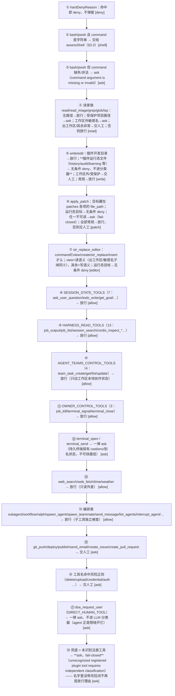
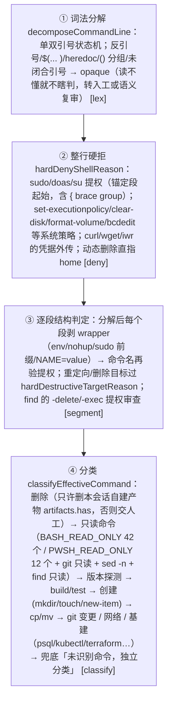
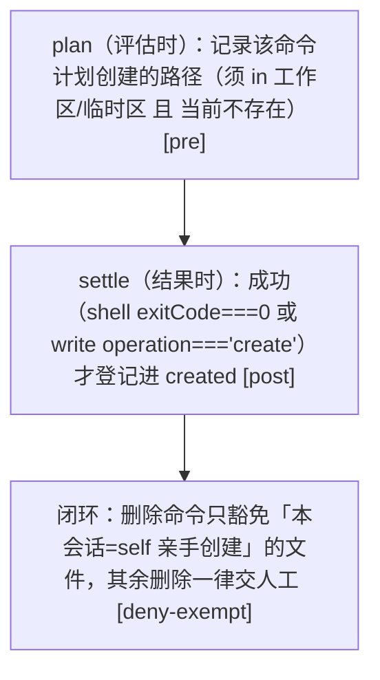

# 03 · 静态评估引擎
> *src/auto —— 不依赖数据库的纯判定*

host 编排在 `src/index.ts`，真正「长脑子」的静态规则引擎在 `src/auto/`。三者移植自 @nanmicoder/dsh-auto-mode（MIT），并在本项目重写为独立实现。

下表「行」列为该文件**当前总行数快照**（行号后的 `#` 是整文件锚点，只声明文件存在、不声明任何行号），随源码增删会漂移；本页所有 `<span class="lnum">` 锚点由 `node scripts/check-anchors.mjs` 核对，摘要分开报「声明/字面量定位」与「仅范围核对」两档——无符号可查的锚点永远不会被算作已验证。

| 文件 | 行 | 职责 |
|---|---|---|
| `constants.ts` <span class="lnum">constants.ts#</span> | 116 | 数值阈值默认值**唯一事实源**：5/8/10s、3/20、4000、8s/1024，及学习族（阈值 3/TTL 30d/100 条/会话放行帽 50）；同时承载设置卡「默认放行工具」显示目录（显示镜像，非放行面） |
| `risk-tokens.ts` <span class="lnum">risk-tokens.ts#</span> | 24 | HIGH 风险正则（NAME/REASON），供分类器与 policy 共用，防漂移 |
| `paths.ts` <span class="lnum">paths.ts#</span> | 264 | 路径规范化（Windows 命名空间/NT 别名折叠、~ 展开、win32 小写）、受保护/关键路径判定、运行态文件名单 |
| `shell.ts` <span class="lnum">shell.ts#</span> | 1632 | Bash/PowerShell 词法分解（sticky 正则状态机）＋ 整行熔断 ＋ 逐段静态分类 |
| `policy.ts` <span class="lnum">policy.ts#</span> | 549 | 每次工具调用的确定性第一遍分类 `assessTool`（推断型、保留类型检查） |
| `rules.ts` <span class="lnum">rules.ts#</span> | 435 | Claude-Code 风格声明规则解析/求值（纯函数，host 与浏览器共用） |
| `classifier.ts` <span class="lnum">classifier.ts#</span> | 101 | 预分类提示词、参数脱敏、严格响应解析 |
| `dsh-classifier.ts` <span class="lnum">dsh-classifier.ts#</span> | 141 | 复用 `ctx.llm` 做低 token 分类请求（temperature 0） |
| `decision.ts` <span class="lnum">decision.ts#</span> | 852 | 纯决策函数：评审解析、人机竞速、来源标注、熔断状态机、静态名单 |
| `trust.ts` <span class="lnum">trust.ts#</span> | 272 | web 路由信任平面（loopback/LAN 边界、Host 伪造防护、在线端点 URL 校验） |
| `artifacts.ts` <span class="lnum">artifacts.ts#</span> | 125 | 本会话成功创建路径的内存出处登记（删除豁免依据） |
| `audit.ts` <span class="lnum">audit.ts#</span> | 125 | append-only 审批审计（清空留墓碑、5MiB 裁剪；审计路径可被测试接缝重定向） |
| `review-mode.ts` <span class="lnum">review-mode.ts#</span> | 56 | 每会话评审模式持久化快照 |

> 同层的其余模块（类别层 `category.ts`、学习层 `learning.ts`、diff 预览 `editdiff.ts`、耗时遥测 `latency.ts`、上下文探针 `probe.ts`、结果脱敏 `redact.ts`、重试 `retry.ts`）各有专章或见 [§14](./14-code-map) 全量清单。

## 3.1　assessTool —— 每一次调用的 18 步判定 <span class="lnum">policy.ts:LassessTool</span>

下面 18 个分支与 `assessTool` 的判定顺序一一对应。一级分支数没有变，但读/写/补丁/编辑四步内部各自长出了**子闸**（受保护读、敏感名熔丝、插件运行态无条件拒）；每一步的代码判别点见 3.1.1 表。



### 3.1.1　每个分支的代码判别点

锚点写成符号/字面量而非行号：行号会随同文件其它改动漂移，符号与字面量只有在判别点本身被改写时才会失效。

| 步 | 分支 | 判别点锚点 |
|---|---|---|
| ① | 同步硬拒 | <span class="lnum">policy.ts:LhardDenyReason</span> |
| ② | bash/pwsh → assessShell | <span class="lnum">policy.ts:L"assessShell(args.command, exec.name, roots, artifacts, owner)"</span> |
| ③ | command 缺失/非法 | <span class="lnum">policy.ts:L"command argument is missing or invalid"</span> |
| ④ | 读家族 | <span class="lnum">policy.ts:L"const readTools = new Set"</span>；受保护读 <span class="lnum">policy.ts:L"silently read through the `read` tool family"</span>；敏感名熔丝 <span class="lnum">policy.ts:L"A relaxation that newly admits a path outside the"</span> |
| ⑤ | write/edit | 运行态无条件拒 <span class="lnum">policy.ts:L"silently rewriting the audit trail"</span> |
| ⑥ | apply_patch | 目标读取 <span class="lnum">policy.ts:LpatchTargetPaths</span>；不可读 → ask <span class="lnum">policy.ts:L"apply_patch target paths are missing or unreadable"</span> |
| ⑦ | str_replace_editor | 命令校验 <span class="lnum">policy.ts:L"str_replace_editor command is missing or invalid"</span>；view 读子闸 <span class="lnum">policy.ts:L"Mirror of the read family above"</span> |
| ⑧ | SESSION_STATE_TOOLS | <span class="lnum">policy.ts:LSESSION_STATE_TOOLS</span> |
| ⑨ | HARNESS_READ_TOOLS | <span class="lnum">policy.ts:LHARNESS_READ_TOOLS</span> |
| ⑩ | AGENT_TEAMS_CONTROL_TOOLS | <span class="lnum">policy.ts:LAGENT_TEAMS_CONTROL_TOOLS</span> |
| ⑪ | OWNER_CONTROL_TOOLS | <span class="lnum">policy.ts:LOWNER_CONTROL_TOOLS</span> |
| ⑫ | 持久终端 | <span class="lnum">policy.ts:L"stateful terminal execution requires explicit approval"</span> |
| ⑬ | 只读外查 | <span class="lnum">policy.ts:L"read-only external information lookup"</span> |
| ⑭ | 编排类 | <span class="lnum">policy.ts:L"orchestration call; child tool actions remain independently checked"</span> |
| ⑮ | 外部写 | <span class="lnum">policy.ts:L"external write requires specific user"</span> |
| ⑯ | 风险工具名正则 | <span class="lnum">policy.ts:LriskyPluginToolReason</span> |
| ⑰ | DIRECT_HUMAN_TOOL | <span class="lnum">policy.ts:L"direct human request"</span> |
| ⑱ | fail-closed 兜底 | <span class="lnum">policy.ts:L"unrecognized registered plugin tool requires independent classification"</span> |

::: warning 第⑱步语义
兜底方向是「拿不准就问人」：一个注册插件工具若没有任何已知形态可对号入座，一律转人工并允许语义分类器介入，**绝不因为「名字无害」而静默放行**。
:::

## 3.2　硬拒闸门 hardDenyReason <span class="lnum">policy.ts:LhardDenyReason</span>

- **凭据物质**：`web_fetch/curl/wget` 或外部写工具，参数里含 PEM 私钥、`sk-` / `ghp_` / `github_pat_` / `xox*`、`AKIA[0-9A-Z]{16}`、aws 密钥赋值、`Bearer …`、`.ssh` 路径等 → 拒（判别点 <span class="lnum">policy.ts:LcontainsCredentialMaterial</span>）。
- **shell 熔断**：bash/pwsh 命令走 `hardDenyShellReason`（见 [§3.3](#33shell-命令分析管线)）。
- **变更目标不可读**：write/edit/apply_patch/str_replace_editor(≠view) 目标解析不出 → 拒（fail-closed，宁可误拒）。
- **破坏性工具指向受保护路径** → 拒。

## 3.3　shell 命令分析管线 <span class="lnum">shell.ts#</span>

管线入口 `assessShell`（<span class="lnum">shell.ts:LassessShell</span>）、词法分解 `decomposeCommandLine`（<span class="lnum">shell.ts:LdecomposeCommandLine</span>）、整行熔断 `hardDenyShellReason`（<span class="lnum">shell.ts:LhardDenyShellReason</span>）：



- 只读名单刻意**不含** `cd`（会改变后续段 cwd 解析基准）。
- `routineInlineProbe`：`python -c` 只放行 import/print 字面量，`node -e` 只放行 require/console.log(process.version) —— 内联代码只认可「绝对安全」形态。
- 危险 token 提取：`sensitiveMarker`（.ssh/.env/密钥关键词）、`dshHomeExfil`（4 组模式抓 DSH_HOME 外传）、`dynamicHomeTarget`（$HOME 动态目标）→ 全部绕过静态判定。
- **写重定向脱离只读快径**：命令含真实文件写重定向（`>`/`>>`/`>|`/`&>`/`N>`，非 discard sink）时，其段不得走只读命令快径放行——落入既有评估流；`/dev/null`、NUL、`$null` 等 discard sink 维持快径。
- **build/test 与版本探测快径目标守卫**：快径仅保留给「写目标全为 discard sink 或工作区内非敏感非受保护非运行态路径」——区外/敏感/受保护/运行态目标一律脱离快径进入正常评估（`categoryMode: aggressive` 与 trustedDirs 放宽模式同样生效）。

## 3.4　路径保护清单 <span class="lnum">paths.ts#</span>

判定函数：`hardDestructiveTargetReason` <span class="lnum">paths.ts:LhardDestructiveTargetReason</span>、`isProtectedProjectPath` <span class="lnum">paths.ts:LisProtectedProjectPath</span>、运行态名单 `runtimeStateTargetReason` <span class="lnum">paths.ts:LruntimeStateTargetReason</span>。

| 类别 | 内容 | 判定 |
|---|---|---|
| 家目录根 / DSH_HOME 树 | `~` 、`~/.dsh`（env DSH_HOME 或默认） | `hardDestructiveTargetReason` → 硬拒（allowedDshSubpaths 白名单可豁免） |
| 凭据根 | `.ssh` `.gnupg` `.aws` `.azure` `.kube` `.config/gcloud` | isCriticalPath |
| shell 启动文件（12） | `.bashrc` `.bash_profile` `.bash_login` `.bash_logout` `.profile` `.zshrc` `.zprofile` `.zlogin` `.zlogout` `.kshrc` `.cshrc` `.tcshrc` | isCriticalPath（家目录变体硬拒；工作区变体 ask） |
| 系统关键目录 | POSIX: `/etc` `/bin` `/sbin` `/usr` `/system` `/library` `/private/etc` `/boot` ；Win: `windows/program files/boot…` | isCriticalPath |
| 工作区元数据首段 | `.git` `.vscode` `.idea` `.husky` `.dsh` | isProtectedProjectPath → 读/写都交人工 |
| 秘密文件 basename | `.gitconfig` `.gitmodules` `.bashrc` `.bash_profile` `.zshrc` `.zprofile` `.profile` `.mcp.json` `.netrc` `.npmrc` `.pypirc` | isProtectedProjectPath |
| 环境密钥文件 | `.env` / `.env.*`（**.env.example 例外**） | isProtectedProjectPath |
| Git 元数据（读取） | `.git/HEAD`、`.git/refs/**` | **`isGitRefReadPath` 打开的固定例外**（无凭据内容，四种读者 + shell 读命令都放行） |
| Git 元数据（其余 / 一切写入） | `.git/config`、`.git/hooks/**`、`.git/objects/**`、`.gitmodules` 等 | 仍 `protected`（`isProtectedReadMetadata` 只减去 HEAD/refs 的**读取**） |
| Windows 设备/NT 命名空间 | `\\.\` `\device\` `\\?\` `\??\`（非 UNC/X: 变体） | `canonicalizeWindowsNamespace` 折叠后再判包含 |
| 保留设备名 | `con` `prn` `aux` `nul` `com1-9` `lpt1-9` | 硬拒 |

**symlink 逃逸**：文本层判定无法识破**快捷方式/软链接指向工作区外**（如 `ws/ln → ~/.bashrc`）。宿主侧守卫 `symlinkEscapeReason`（<span class="lnum">symlink.ts:LsymlinkEscapeReason</span>，宿主在 guard 处调用）取每个工具的真实路径操作数，对「文本上在工作区内/受信区」的目标做 realpath 最深祖先解析，一旦真实路径离开工作区/受信区就硬拒。**该守卫必须覆盖每个读者**：官方宿主自己不拒绝 symlink 逃逸（`dsh-tools` 产物内 `realpath/lstatSync/readlink` 零命中，它只在 allow 后征求已注册 guard），所以「谁的路径操作数没被提取」就等于「谁没有逃逸复检」——`str_replace_editor` 的 `view` 曾因按「仅突变才可能逃逸」的假设被排除，使工作区 junction 指向的凭据文件可经该读者静默读取，现已纳入（`tests/view-reader-parity.test.mjs`）。**`bash` / `pwsh` 同样已纳入**（`shellGuardTargets`，<span class="lnum">shell.ts:LshellGuardTargets</span>）：shell 的目标藏在命令串里，故由一个复用同一词法器（`decomposeCommandLine`）、同一路径归一化（`normalizePath`）与同一 changer 基准 owner（`effectiveCwdAfter`）的操作数提取器负责——**裸相对拼写**（`cat ext/id_rsa`）与**`cd <目录> && cat <相对名>`** 这两类此前完全不可见；bash 把 `\` 当转义符而吞掉未加引号的反斜杠绝对路径，故另有一条**字面绝对拼写回收**（仅 drive-letter / UNC 形状，非第二套词法）。**shell 的裁定刻意比结构化读者窄、且与位置模式无关**：只有「realpath 离开工作区∪受信区」**且**落在凭据树 / `DSH_HOME` / 插件运行态文件时才硬拒——与 `read` 全量对齐会把这本仓库自用的 `node_modules` junction 普通读一并硬拒；`node_modules` 这类普通外部落点在 aggressive 与 standard 下都保持原行为（这是与结构化读者的**已知差异**）。区域比较同时用**解析后的工作区**（`realWsNormalized`）与文本工作区：本仓库自身的会话工作区就位于 `~/.dsh/plugins/…`，只看文本会让每个普通读都算逃逸、再由 `DSH_HOME` 子句成片硬拒。**两条已知边界（如实写明）**：①**引号内的字面量会被当作真实目标**——`git commit -m "…C:/Users/…/.ssh/…"`、`rg "~/.ssh" docs/` 这类只是**提及**该路径的命令会被硬拒（方向上 fail-closed，与 opaque 重定向恢复已接受的同类误报一致；若运维反馈频繁再评估按 tokenizer 精确化）；②opaque 行（含 `(`/`{`/`$(`/heredoc）不猜操作数，保持原行为，除非行内出现字面绝对拼写。**另三条可达性边界**：宿主只在 `allow` 之后征询 guard，所以该复检只覆盖**旧行为是静态放行**的落点（junction 逃逸、`DSH_HOME` 内读取）；pre-execute 已判 `ask`/`deny` 的形状（如 `cat <绝对 ~/.ssh/id_rsa>`、含 `cd` 的整行）在 guard 之前就被拦，本复检不改其行为。③**拼写决定静态熔断面**：包含型熔断（`isWithin`/`isCriticalPath`）在两侧路径风格不一致时判「不在范围内」，故 MSYS 风格拼写（`/c/Users/…/.dsh/…`）不落入 `DSH_HOME`/凭据树子句，也不落入 shell 的无条件 `DSH_HOME` 写熔断，交语义评审（classifier）判定；win32（`C:\…`）与 `~` 拼写仍在静态熔断内。`/c/...` 在 POSIX 宿主上是真路径而非别名，故该取舍跨平台保留（`tests/contract-devloop.test.mjs`、`tests/cd-relative-anchor.test.mjs` 已钉）。守卫解析的是**归一化后的文本路径**（`resolveDeepest(textual)`，<span class="lnum">symlink.ts:LresolveDeepest</span>）：若拿原始参数 realpath，相对路径会被锚定到 `process.cwd()` 而非会话工作区，`dsh web` 下会把所有相对路径调用误硬拒（PR #4 修复）。受信区不止插件目录：`trustedDirs` 成员与 allowedDshSubpaths 一并构成复检区；aggressive 模式下「普通出区」是设计目标故放行，但落在 critical 树 / DSH_HOME / 插件运行态文件上的逃逸仍硬拒——运行态文件复检与位置模式无关，改审批/审计/学习状态在任何模式下都不算例行写。

## 3.5　声明式规则 rulesText <span class="lnum">rules.ts#</span> —— 用户写的「最优先纸条」

```text
# 语法（每行一条，空行与 # 注释忽略）
Tool(pattern) | allow|deny|human [| reason|toolName|arguments]
pattern       | allow|deny|human [| field]

# 例：禁止任何含 "rm -rf" 的 bash
bash(rm\s+-\s*rf) | deny
# 例：任何工具的 any_dangling 参数命中即交人
(any_dangling)     | human
```

- 工具作用域可逗号多选（含 `*` 通配）；无括号则适配所有工具；field 缺省 `arguments`。
- **首条命中即胜**；`evaluateRules` 先用 `extractRuleTarget` 抽取命令文本（command/script/code/prompt/text/content），防锚定正则（如 `^git push`）被 JSON 信封击穿。
- ReDoS 防护：长度 ≤2000；拒绝嵌套无界量词 `(a+)+`、交替外套量词、嵌套重复组、`{n,}` 计数重复。
- **host 与浏览器设置卡共用同一份 `parseRulesText`**（错误逐行红字显示）。
- 干跑 `rulesDryRun`：只记命中不执法（host 端 `if (config.rulesDryRun)` 两处：pre-execute 与 answerer）。

## 3.6　产物登记 ArtifactRegistry <span class="lnum">artifacts.ts:LArtifactRegistry</span>


