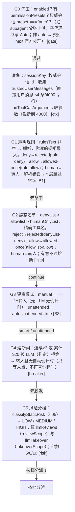

# 04 · approval/request 终局裁决管线

> *The Lone Adjudicator*

这是整个插件的心脏。以下决策顺序与 index.ts:L1792-2089 逐行一致，绿色 = 放行、红色 = 拒绝、蓝色 = 转人工/面板。

**🟢 LOW 低风险**
- 不送评审 → 直接 **auto-allow** 放行（记录 `auto-allow`）
- 送评审 → **阻塞等** LLM 结论：ALLOW→放行并**清零熔断**；DENY→拒绝并**计数**；评审失败→拒绝**不计熔断**；ESCALATE→转人（带倒计时）
- ALLOW+CRITICAL → 不放行，转人（矛盾输出不信任）

**🟡 MEDIUM 中等**
- 弹面板 + 倒计时，**并行**跑 LLM 复审（fire-and-forget）
- 若属于 `llmTakeoverScope` 或 unattended，且 LLM 给明确 ALLOW/DENY（非 CRITICAL-ALLOW）→ `handle.claim` 抢占竞速，**立即按 LLM 结论结案**（source=llm-*）
- 否则 LLM 结论只是**建议**（`🤖 Review suggestion` 刷新在面板上），最终听人/超时/接管

**🔴 HIGH 高危**
- 弹面板 + 倒计时（10s 默认）
- LLM 复审**永远只当建议**（`🤖 Review suggestion`），**绝不接管**
- unattended 模式下 HIGH 超时强制转人/失败关闭，方向正确性不让步

::: tip askHuman 内部做了同一件事
（index.ts:L1611-1790）：把状态写进 `reviewStates`（客户端轮询用）→ 组装 notes（评审建议 / 「⚠️ Breaker」原因列表 / 「⏳ will auto-X in Ns」）→ 追加到 `req.reason` → 走 `raceHumanDecision`（[§07](./07-human-race)）→ 计算诚实来源 → `applyBreaker` 更新熔断 → `pushHistory` 落盘。任何一环抛错（会话销毁/请求取消）→ 标记 abort、清残留、rethrow —— **绝不伪造裁决**。
:::