# 04 · approval/request 终局裁决管线

> *The Lone Adjudicator*

```mermaid
flowchart TD
    A1["G0 门卫：enabled？有 permissionPresets？权威会话 preset === 'auto'？（沿 subagent 父链上溯，子代理继承 Auto；非 auto → 交回 next 官方处理） [gate]"] -->|通过| A2["准备：sessionKey=权威会话 id；收集 trustedUserMessages（直接用户消息 ≤4 条/4000 字符）；findToolCallArguments 取参数（截断到 4000）；classifyStaticRisk 在此算出 风险档+类别指令（L2481，一次计算全层复用） [ctx]"]
    A2 --> A3["G1 声明规则：rulesText 非空 → 解析，你写的规矩最大。deny→rejected(rule-deny)；allow→allowed-once(rule-allow)；human→转人；解析错误→本层跳过继续 [B1]"]
    A3 -->|未命中| A4["G2a 静态名单 · denyList：精确工具名命中 → rejected(denyList-deny) [lists·deny]"]
    A4 -->|未命中| A5["类别层 · deny：directive==='deny' → rejected(category-deny)，与 denyList 同构的终端拒绝，提权重试不可绕过 [category·deny]"]
    A5 -->|非 deny| A6["G2b 静态名单 · allowlist/humanOnlyList：allow→allowed-once(allowlist-allow)；human→转人；有意不读熔断 [lists]"]
    A6 -->|continue| A7["类别层 · ask：directive==='ask' → 无条件转人（status-less askHuman，无宿主倒计时，跳过一切自动路径） [category·ask]"]
    A7 -->|inherit| A8["G3 评审模式：manual → 一律转人（无 LLM 无倒计时）；unattended → autoUnattended=true [B3]"]
    A8 -->|smart / unattended| A9["G4 熔断闸：连续≥3 或 累计≥20 被 LLM（判定）拒绝 → 转人且无自动倒计时（只等人点，不再替你超时） [breaker]"]
    A9 -->|未触发| A10["策略层 DENY：静态评估带硬拒理由（插件运行态文件等）→ 立即 rejected(policy-deny)：无倒计时、不计熔断、不发布 review-status [policy·deny]"]
    A10 -->|非 DENY| A11["学习层 learned-allow：learningEnabled 且签名命中历史人工确认 → **仍须过一次标准在线评审**，clean ALLOW 才放行（source=learned-allow），其余一律回退原风险分支（§18） [learn·allow]"]
    A11 -->|未命中 / 回退| A12["G5 风险分档：LOW / MEDIUM / HIGH；算 llmReviews（reviewScope）与 llmTakeover（takeoverScope）；秒数 5/8/10 [risk]"]
    A12 -->|按档分派 ↓| A13["按档分派"]
```

这是整个插件的心脏。以下决策顺序与 index.ts:L2379-2794（注册体；互斥器/askHuman/learnAttempt 等前置件自节注释 index.ts:L2003 起）逐行一致，红色 = 拒绝、蓝色 = 转人工/面板、绿色 = 放行。

**🟢 LOW 低风险**
- 不送评审 → 直接 **auto-allow** 放行（记录 `auto-allow`）
- 送评审 → **阻塞等** LLM 结论：ALLOW→放行并**清零熔断**；DENY→拒绝并**计数**；评审失败→拒绝**不计熔断**；ESCALATE→转人（带倒计时）
- ALLOW+CRITICAL → 不放行，转人（矛盾输出不信任）

**🟡 MEDIUM 中等**
- 弹面板 + 倒计时，**并行**跑 LLM 复审（fire-and-forget）
- 若属于 `llmTakeoverScope` 或 unattended，且 LLM 给明确 ALLOW/DENY（非 CRITICAL-ALLOW）→ `handle.claim` 抢占竞速，**立即按 LLM 结论结案**（source=llm-*）
- 否则 LLM 结论只是**建议**（`🤖 Review suggestion` 刷新在面板上），最终听人/超时/接管

**🔴 HIGH 高危**
- 弹面板 + 倒计时（10s 默认）
- LLM 复审**永远只当建议**（`🤖 Review suggestion`），**绝不接管**
- unattended 模式下 HIGH 超时强制转人/失败关闭，方向正确性不让步

::: tip askHuman 内部做了同一件事
（index.ts:L2068-2291）：把状态写进 `reviewStates`（客户端轮询用，L2072）→ 组装 notes（评审建议 / 「⚠️ Breaker」原因列表 / 「⏳ will auto-X in Ns」/ diff 预览）→ 追加到 `req.reason` → 走 `raceHumanDecision`（[§07](./07-human-race)，L2130）→ 计算诚实来源（`approvalSource`，L2208）→ `applyBreaker` 更新熔断（L2222）→ `pushHistory` 落盘（L2251）→ **学习层记账**（L2267-2284：`human-allow` 计数、`human-deny` 清零，见 [§18](./18-confirm-learning)）。任何一环抛错（会话销毁/请求取消）→ 标记 abort、清残留、rethrow —— **绝不伪造裁决**。
:::

::: tip 类别层有第二个接线点
`tools/pre-execute` 侧另有一段**独立的**类别收紧（index.ts:L1868-1885）：只做收紧（deny 终端拒 + ask 跳过分类器快径），不产放行。它与 answerer 侧两个接点各自从零重算类别与指令，**无任何状态跨越**（`categoryDirectiveFor` 注释明言，category.ts:L611-616）——一次调用被两层检查，但不存在「上层记住下层结论」的耦合。
:::