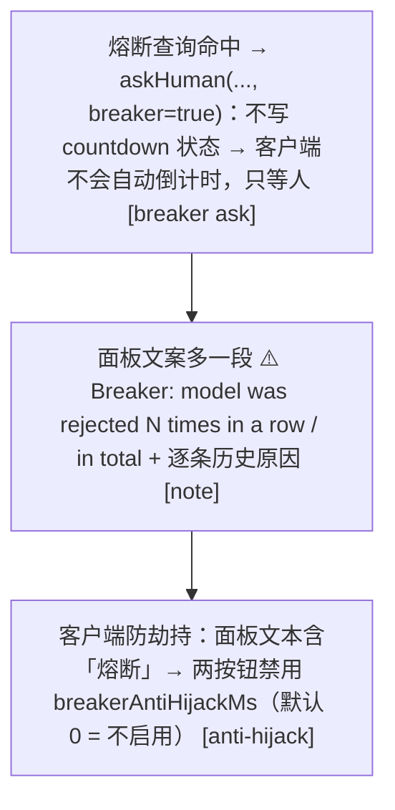

# 08 · 熔断器状态机
> *The breaker*

**为什么有它**：评审者也是 LLM，会退化、会被骗。如果它开始乱拒绝（或乱放行不可观测），自动档就不可信了 → 熔断：**转人工、停自动倒计时**。

## 8.1　状态与双轨阈值

| 计数器 | 键 | 语义 |
|---|---|---|
| `denials` | 权威会话 id | 连续被 LLM 判定拒绝的次数 |
| `totalDenials` | 权威会话 id | 累计被 LLM 判定拒绝的次数 |
| `denialLog` | 权威会话 id | 最近拒绝原因（上限=maxConsecutiveDenials 条，交给人工看） |

**触发**（`breakerTripped`）：`maxConsecutiveDenials > 0 && 连续 ≥ 阈值`（默认 3）**或** `maxTotalDenials > 0 && 累计 ≥ 阈值`（默认 20）；任一轨为 0 = 关闭。

## 8.2　状态转移表 `applyBreaker` decision.ts:L258-274

| 本次决议来源 | 连续 | 累计 | denialLog |
|---|---|---|---|
| `human-allow / human-deny（人决定了）` | 清零 | 清零 | 清空 |
| `llm-allow（LOW 放行 或 MEDIUM 接管放行）` | 清零 | 清零 | 清空 |
| `llm-deny 且 llmDecided=true（真·LLM 拍板拒绝）` | +1 | +1 | push（超上限 shift） |
| `timeout-* / auto-* / advisory 拒绝 / llm-failed / 静态名单` | 不变 | 不变 | 不变 |

::: tip 并发安全
**并发安全**：计数器读-改-写（连续两个 await 之间）用 `createKeyedMutex`（decision.ts:L491-519，per-key Promise 链）串行化——同会话并发审批不会丢失一次 +1；不同会话保持并发。
:::

::: tip 生命周期
**生命周期**：`session/disposed` 在锁内删除该会话键；`/approval reset` 清两个计数器 + denialLog + 全部 7 张 approvalState 表（reviewStates/followExpiry/reviewVerdicts/autoAnswered/resolvedCallIds/timeoutFeedback/decisionFeedback）。
:::

## 8.3　触发生效后的人工面

**恢复路径**：① 人做任何决定 → 双清零；② LOW 被 LLM 放行 → 双清零；③ `/approval reset`；④ 会话销毁 → 删键。评审失败（`llm-failed`）**不**计熔断 —— 失败怪线路/超时，不怪 LLM 判断。