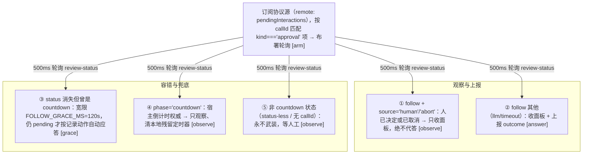

# 10 · 客户端 UI 结构
> *Browser side*

### Slot 注册

| slot | id | order | 组件 |
|---|---|---|---|
| `settings.plugin.item` | `auto-approval-llm-card` | 30 | SettingsSection |
| `conversation.session.header.utilities` | `…-session-panel` | -10 | SessionApprovalPanel |

另有：会话标题栏按钮（header/floating 两种形态）、`auto-icon.ts`（给权限菜单的 Auto 注入盾形图标 + 选择时的风险确认弹窗「我已了解风险」）、`locale.ts`（zh/en）。

### 关键设计：客户端不自绘审批卡片

官方面板由 DSH 渲染，本插件通过 `MutationObserver` 盯 `document.body`，扫描 `[data-approval-key]` 面板做 DOM 增强：

- 从面板文本解析 `⏳ will auto-(approve|reject) in Ns` 标记，把 `（Ns）` 倒计时后缀**只贴到「会超时自动执行」的那个按钮**上（timeoutAction=allow → 允许一次；否则 → 拒绝），每 200ms 刷新。
- 面板文本含「熔断」→ 双按钮禁用 `breakerAntiHijackMs`。
- 非 UI 轮询器（0.0.12 起拆为 `approvals/` 模块）：`remote` watcher 观察 `uiSession.pendingInteractions`（rc.1 唯一协议源；rc.2 的 `snapshot.pending` 适配器已随 0.0.16 移除）；核心 `shared.startReviewPolling` 500ms GET `/review-status`（callId 走 `x-auto-approval-call-id` 头，不进 URL），五分支处理 countdown/follow/grace/无状态。

## 10.1　应答状态机（自动应答的大脑，approvals/ 模块）



`answerOnce`（shared）只把 `outcome ∈ {allowed-once, rejected}` 传上网（POST /feedback + 协议应答 `pending.answer(outcome)`，对已 settle 实例抛错被静默处置），通告文案由宿主生成；`answeredApprovals` 统一以 `sessionId:callId` 为键保证同一审批只答一次。

## 10.2　设置卡解剖（settings.plugin.item）

```text
li.dsa-card（可折叠；任一卡脏 → 头部「未保存」徽标）
├─ 非法配置红横幅 + 「尝试修复」        ← 检测表镜像 host schema；reviewerProvider/Model 成对校验
├─ 调试横幅（debug=on 时）+「关闭调试」
├─ 顶层开关区（6 个即时保存 CapsuleSelect）
│    enabled · timeoutAction · 评审与接管预设（一次写
│    llmReviewScope + llmTakeoverScope 两键；非预设 YAML 组合显示「自定义」兜底，选中不写值）
│    · defaultReviewMode · showSessionPanel · aiButtonPosition(条件显示)
├─ 首次使用引导块（一次性：首次展开即显示，折叠时写 localStorage
│    dsa-onboarding-seen-v1 后不再出现；标题+三行+提示；第二行的
│    {timeout} 标签按实时 timeoutAction 渲染，非 reject 不出现「拒绝」）
├─ 6 张可折叠子卡（均独立 保存/放弃；安全规则卡另有 恢复默认）
│    ├─ [安全底线] 计时器与熔断   风险倒计时一行（低/中/高三组内联输入）· LLM 等待时间一行（秒，1-10，重置=THRESHOLD_DEFAULTS） · 拒绝熔断阈值一行（连续/累计）（重置=THRESHOLD_DEFAULTS）
│    ├─ [安全底线] 安全规则列表   safetyPrompt · 精确名单（页签切换 allowlist/denyList/humanOnlyList，单个复用 textarea 按页签绑定三字段）
│    │                · redactResults · editDiffPreview（默认关的增强开关）· rulesText(实时语法校验)
│    ├─ [安全底线] 分类开关与信任模式   categoryMode(standard/aggressive，切 aggressive 弹放开范围警示)
    │                · privilegeAutoReview 开关（提权类别解锁，默认关；开启后 privilege 行可选 自动/拒绝）
│    │                · 11 类逐行三态 CapsuleSelect（LOCKED 类只剩 继承/人工询问 可选；privilege 解锁后恢复三态）
│    ├─ [安全底线] 确认制学习     learningEnabled(on/off) · learningThreshold(数字输入 min2 max10，保存钳回 2..10)（阈值行仅开关=on 时显示）（<span class="lnum">client/index.ts:L1761-1782</span>）
│    ├─ 在线评审模型   协议(openai/anthropic) · API地址 · 模型 · 密钥(password型)「已配置|未配置」· 测试连接（恢复默认=三键回默认并清除评审密钥）
│    └─ 最近审批记录   搜索 · 分页(PAGE_SIZE=10) · 记录+[熔断]+原因(warn色) + LLM 响应耗时统计 · 清空历史(confirm)
└─ 底部 footer：恢复默认 · 重启提示(applies=restart) · 全局错误行
```

> 分组标签（只加标签不移动控件）：前四张子卡（计时器与熔断 / 安全规则列表 / 分类开关与信任模式 / 确认制学习）标题带「安全底线」标签（计时器含倒计时秒数——决策窗口属安全项；`settings.group.safetyBase` 键），评审模型卡与历史卡保持现状。归组合约：后续新增设置键默认进安全底线组。

- **保存语义**：每卡只 POST 自己拥有的键（`sliceValueOf`），叠加到「最后保存基线」上 —— 保存 A 卡不会吞掉 B 卡未保存的编辑；顶层开关即时保存（预设行一次提交两个键、其余单键；`expectedRevision` 乐观并发控制）。学习子卡只提交 `LEARNING_KEYS = ['learningEnabled','learningThreshold']` 两键（<span class="lnum">client/index.ts:L1106</span>），threshold 保存时钳入 2..10。
- **host-only 键保护**：九员名单 `workspaceRoot / dshHome / tempRoots / trustedDirs / classifierTimeoutMs / classifierMaxOutputTokens / maxArgsChars / notifyUser / reviewerContextFacts`（<span class="lnum">decision.ts:L224-234</span>）走 patch/YAML 配置；保存时 `preserveHostKeys` 让存储值**恒胜出**，卡片改不掉它们。其中 `trustedDirs` 与 `reviewerContextFacts` 完全没有设置卡控件，改动入口只有 YAML。
- **密钥永不出现在 settings value**：独立 `/reviewer-credential` 路由；输入框 password + new-password 自动完成；保存后立即清空不回显。

## 10.3　会话标题栏「自动审批」统计

<table>
  <tr><th>形态</th><th>触发</th><th>内容</th></tr>
  <tr>
    <td>header（React，slot utilities）</td>
    <td><code>aiButtonPosition='header'</code>；<code>panelMode≠off</code>；auto 模式还要求当前会话是 auto</td>
    <td rowspan="2">GET /history 过滤本会话 slice(50)，算 <b>total/allow/deny/timeout/breaker</b> + 最近 ≤10 条记录；浮动按钮为原生 DOM 版（settings overlay 打开时隐藏）</td>
  </tr>
  <tr>
    <td>floating（原生 DOM）</td>
    <td><code>aiButtonPosition='floating'</code>，同可见性门</td>
  </tr>
</table>