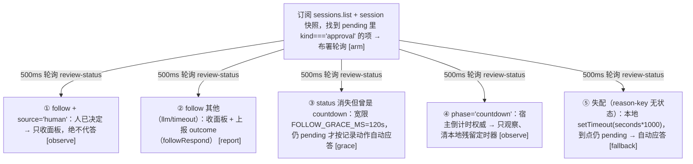

# 10 · 客户端 UI 结构
> *Browser side*

### Slot 注册

| slot | id | order | 组件 |
|---|---|---|---|
| `settings.plugin.item` | `auto-approval-llm-card` | 30 | SettingsSection |
| `conversation.session.header.utilities` | `…-session-panel` | -10 | SessionApprovalPanel |

另有：会话标题栏按钮（header/floating 两种形态）、`auto-icon.ts`（给权限菜单的 Auto 注入盾形图标 + 选择时的风险确认弹窗「我已了解风险」）、`locale.ts`（zh/en）。

### 关键设计：客户端不自绘审批卡片

官方面板由 DSH 渲染，本插件通过 `MutationObserver` 盯 `document.body`，扫描 `[data-approval-key]` 面板做 DOM 增强：

- 从面板文本解析 `⏳ will auto-(approve|reject) in Ns` 标记，把 `（Ns）` 倒计时后缀**只贴到「会超时自动执行」的那个按钮**上（timeoutAction=allow → 允许一次；否则 → 拒绝），每 200ms 刷新。
- 面板文本含「熔断」→ 双按钮禁用 `breakerAntiHijackMs`。
- 非 UI 轮询器 `watchApprovals`：500ms GET `/review-status`（callId 走 `x-auto-approval-call-id` 头，不进 URL），五分支处理 countdown/follow/失配。

## 10.1　watchApprovals 状态机（自动应答的大脑）



`followRespond/autoRespond` 只把 `outcome ∈ {allowed-once, rejected}` 传上网（POST /feedback + wait.respond），通告文案由宿主生成；`answeredApprovals` Set 保证同一审批只答一次。

## 10.2　设置卡解剖（settings.plugin.item）

```text
li.dsa-card（可折叠；任一卡脏 → 头部「未保存」徽标）
├─ 非法配置红横幅 + 「尝试修复」        ← 检测表镜像 host schema；reviewerProvider/Model 成对校验
├─ 调试横幅（debug=on 时）+「关闭调试」
├─ 顶层开关区（8 个即时保存 CapsuleSelect）
│    enabled · autoSwitchPolicyToAsk · timeoutAction · llmReviewScope
│    · llmTakeoverScope · defaultReviewMode · showSessionPanel · aiButtonPosition(条件显示)
├─ 4 张可折叠子卡（均独立 保存/放弃/恢复默认）
│    ├─ 计时器与熔断   低/中/高秒数 · 熔断防劫持ms · 连续/累计阈值（重置=THRESHOLD_DEFAULTS）
│    ├─ 在线评审模型   协议(openai/anthropic) · API地址 · 模型 · 密钥(password型)「已配置|未配置」· 测试连接
│    ├─ 安全规则列表   safetyPrompt · allowlist/denyList/humanOnlyList · rulesDryRun · rulesText(实时语法校验)
│    └─ 最近审批记录   搜索 · 分页(PAGE_SIZE=10) · 记录+[熔断]+原因(warn色) · 清空历史(confirm)
└─ 底部 footer：恢复默认 · 重启提示(applies=restart) · 全局错误行
```

- **保存语义**：每卡只 POST 自己拥有的键（`sliceValueOf`），叠加到「最后保存基线」上 —— 保存 A 卡不会吞掉 B 卡未保存的编辑；顶层开关即时保存（单键 + `expectedRevision` 乐观并发控制）。
- **host-only 键保护**：`workspaceRoot/dshHome/tempRoots/classifierTimeoutMs/classifierMaxOutputTokens/maxArgsChars/notifyUser` 是 patch/YAML 配置，卡片保存时经 `preserveHostKeys` 回填，绝不被抹掉。
- **密钥永不出现在 settings value**：独立 `/reviewer-credential` 路由；输入框 password + new-password 自动完成；保存后立即清空不回显。

## 10.3　会话标题栏「自动审批」统计

<table>
  <tr><th>形态</th><th>触发</th><th>内容</th></tr>
  <tr>
    <td>header（React，slot utilities）</td>
    <td><code>aiButtonPosition='header'</code>；<code>panelMode≠off</code>；auto 模式还要求当前会话是 auto</td>
    <td rowspan="2">GET /history 过滤本会话 slice(50)，算 <b>total/allow/deny/timeout/breaker</b> + 最近 ≤10 条记录；浮动按钮为原生 DOM 版（settings overlay 打开时隐藏）</td>
  </tr>
  <tr>
    <td>floating（原生 DOM）</td>
    <td><code>aiButtonPosition='floating'</code>，同可见性门</td>
  </tr>
</table>