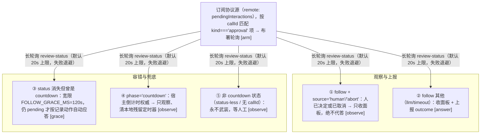

# 10 · 客户端 UI 结构
> *Browser side*

### Slot 注册

| slot | id | order | 组件 |
|---|---|---|---|
| `settings.plugin.item` | `auto-approval-llm-card` | 30 | SettingsSection |
| `conversation.session.header.utilities` | `…-session-panel` | -10 | SessionApprovalPanel |

另有：会话标题栏的自动审批控件（分离按钮：左主区显示状态并在有倒计时时提前展开面板，右下箭头打开审批记录浮层）、`auto-icon.ts`（给权限菜单的 Auto 注入盾形图标 + 选择时的风险确认弹窗「我已了解风险」）、`locale.ts`（zh/en）。

### 关键设计：客户端不自绘审批卡片

官方面板由 DSH 渲染，本插件通过 `MutationObserver` 盯 `document.body`，扫描 `[data-approval-key]` 面板做 DOM 增强：

- 倒计时**不再写进官方按钮**。状态由共享显示存储 `approvals/status-store.ts` 提供，渲染在**会话标题栏的自动审批控件**上（`conversation.session.header.utilities`）：空闲显示控件名（自动审批），有事时显示粗档倒计时（>30s 只给「约 N 分钟」）、≤30s 的秒数、「即将自动放行…」，随后按结构化 phase/source 显示已被自动评审放行/拒绝、超时、人工、取消、需人工决定、熔断、断线；终局状态保留 **1.5s** 后回到空闲文字。断线时冻结最后确认的剩余值，不继续走秒。
- 该控件是**分离按钮**（官方同款结构）：左主区只显示状态文字（暂无动作），右下箭头用官方 chevron 图标，点击打开审批记录浮层（统计 + 最近记录）；主区不再整块可点。
- 面板延迟（`panelDelayMs`）：倒计时审批先只显示状态，经过该时长再让官方审批面板出现，期间输入框可用；窗口内评审给出结论则面板不出现；settled 的 ask 会取消延迟，绝不事后把请求转给客户端。延迟期间客户端用**会话级发现路由** `/session-review-status` 拿到本会话全部待审（官方面板未出现时 `uiSession.pendingInteractions` 里还没有条目）。host 侧 `/reveal-approval` 保留为「提前放行」通道，供后续给左主区接入动作时使用。
- 两处 document 级扫描都按窗口节流（`src/client/throttle.ts` 的尾随节流器）：权限图标装饰 ≤50ms 一次、审批面板扫描 ≤100ms 一次；窗口内合并、窗口末**必有一次尾随执行**（不丢最后一次 DOM 变更），插件安装时的首扫仍是立即执行，卸载/停用时节流器随 observer 一并 dispose。
- 面板文本含熔断 marker（`BREAKER_MARKER`，结构化 token）→ 双按钮禁用 `breakerAntiHijackMs`。无状态下发的 ask 由 host 写 `AWAITING_MARKER`，客户端就地渲染为当前界面语言的句子（host 不再写英文散文）。
- 非 UI 轮询器（0.0.12 起拆为 `approvals/` 模块）：客户端入口把 `remote`/`uiSession`/`slots`/`sessions` 声明为 inject 依赖（不再有 500ms×≤30 探针窗口）；`remote` watcher 观察 `uiSession.pendingInteractions`（rc.1 唯一协议源；rc.2 的 `snapshot.pending` 适配器已随 0.0.16 移除）；核心 `shared.startReviewPolling` GET `/review-status`（callId 走 `x-auto-approval-call-id` 头，不进 URL）并带 `x-auto-approval-wait-ms` **长轮询**（默认 20s 上限，服务端按 revision 变化即时唤醒；忽略该头的老 host 自动退化为 500ms 基准轮询），五分支处理 countdown/follow/grace/无状态。路由连续失败时按指数退避到 5s 上限、成功后立即回到基准：退避**只限制定时轮询**，观察不停止、也绝不由失败推导裁决；事件驱动的 `pollNow`（回连/可见性/解冻重对齐）**不受退避限制**，因此链路恢复时不会额外等一个退避周期。

## 10.1　应答状态机（自动应答的大脑，approvals/ 模块）



`answerOnce`（shared）只把 `outcome ∈ {allowed-once, rejected}` 传上网（POST /feedback + 协议应答 `pending.answer(outcome)`，对已 settle 实例抛错被静默处置），通告文案由宿主生成；`answeredApprovals` 统一以 `sessionId:callId` 为键保证同一审批只答一次。

## 10.2　设置卡解剖（settings.plugin.item）

```text
li.dsa-card（可折叠；任一卡脏 → 头部「未保存」徽标）
├─ 非法配置红横幅 + 「尝试修复」        ← 检测表镜像 host schema；3 值来源枚举（session/preset/endpoint）
├─ 调试横幅（debug=on 时）+「关闭调试」
├─ 顶层开关区（8 个即时保存 CapsuleSelect；第 8 个按条件显示）
│    enabled · timeoutAction · 评审与接管预设（一次写
│    llmReviewScope + llmTakeoverScope 两键；非预设 YAML 组合显示「自定义」兜底，选中不写值）
│    · defaultReviewMode · autoSwitchPolicyToAsk · autoModeNotice · showSessionPanel
├─ 首次使用引导块（一次性：首次展开即显示，折叠时写 localStorage
│    dsa-onboarding-seen-v1 后不再出现；标题+三行+提示；第二行的
│    {timeout} 标签按实时 timeoutAction 渲染，非 reject 不出现「拒绝」）
├─ 7 张可折叠子卡（均独立 保存/放弃；安全规则卡另有 恢复默认）
│    ├─ [安全底线] 计时器与熔断   风险倒计时一行（低/中/高三组内联输入）· LLM 等待时间一行（秒，1-10，重置=THRESHOLD_DEFAULTS） · 拒绝熔断阈值一行（连续/累计）（重置=THRESHOLD_DEFAULTS）· 熔断弹窗防误点毫秒数 breakerAntiHijackMs（恢复默认不动它——防误点窗口只能 YAML 设回）
│    ├─ [安全底线] 安全规则列表   safetyPrompt · 精确名单（页签切换 allowlist/denyList/humanOnlyList，单个复用 textarea 按页签绑定三字段）
│    │                · rulesText(实时语法校验) · rulesDryRun（干跑开关）
│    ├─ [安全底线] 分类开关与信任模式   categoryMode(standard/aggressive，切 aggressive 弹放开范围警示)
    │                · privilegeAutoReview 开关（提权类别解锁，默认关；开启后 privilege 行可选 自动/拒绝）
│    │                · 11 类逐行三态 CapsuleSelect（LOCKED 类只剩 继承/人工询问 可选；privilege 解锁后恢复三态）
│    ├─ [安全底线] 确认制学习     learningEnabled(on/off) · learningThreshold(数字输入 min2 max10，保存钳回 2..10)（阈值行仅开关=on 时显示）（<span class="lnum">client/index.ts:L"const buildLearningBody"</span>）· 已学习条目区块（键哈希 + 脱敏骨架 + 计数，可单条吊销，落 `learning-revoked` 审计）
│    ├─ 实用小功能    onboardingMessageEnabled（首次使用引导消息）· redactResults（成功结果二次脱敏）· editDiffPreview（默认关的增强开关）· rejectGuidance（拒绝引导提示）
│    ├─ 在线评审模型   快速判断模型[来源: 跟随会话/DSH模型(catalog chips 填 Provider·Model)/自定义端点] · 深度评审模型[同构] · 自定义端点[共享：协议·API地址·模型·密钥(password型)「已配置|未配置」· 测试连接]（恢复默认=双通道回 session + 端点配置清空 + 清除密钥）
│    └─ 最近审批记录   搜索 · 分页(PAGE_SIZE=10) · 记录+[熔断]+原因(warn色) + LLM 响应耗时统计 · 清空历史(confirm)
└─ 底部 footer：恢复默认 · 重启提示(applies=restart) · 全局错误行
```

> 分组标签（只加标签不移动控件）：前四张子卡（计时器与熔断 / 安全规则列表 / 分类开关与信任模式 / 确认制学习）标题带「安全底线」标签（计时器含倒计时秒数——决策窗口属安全项；`settings.group.safetyBase` 键），实用小功能卡与评审模型卡、历史卡保持现状。归组合约：后续新增设置键默认进安全底线组。

- **保存语义**：每卡只 POST 自己拥有的键（`sliceValueOf`），叠加到「最后保存基线」上 —— 保存 A 卡不会吞掉 B 卡未保存的编辑；顶层开关即时保存（预设行一次提交两个键、其余单键；`expectedRevision` 乐观并发控制）。学习子卡只提交 `LEARNING_KEYS = ['learningEnabled','learningThreshold']` 两键（<span class="lnum">client/index.ts:L"const LEARNING_KEYS"</span>），threshold 保存时钳入 2..10。
- **host-only 键保护**：11 员名单 `workspaceRoot / dshHome / tempRoots / trustedDirs / trustedDshSubpaths / maintenanceDshPaths / classifierTimeoutMs / classifierMaxOutputTokens / maxArgsChars / notifyUser / reviewerContextFacts`（<span class="lnum">decision.ts:LHOST_ONLY_KEYS</span>）走 patch/YAML 配置；保存时 `preserveHostKeys` 让存储值**恒胜出**，卡片改不掉它们。其中 `trustedDirs`、`trustedDshSubpaths`、`maintenanceDshPaths` 与 `reviewerContextFacts` 完全没有设置卡控件，改动入口只有 YAML。
- **密钥永不出现在 settings value**：独立 `/reviewer-credential` 路由；输入框 password + new-password 自动完成；保存后立即清空不回显。

## 10.3　会话标题栏「自动审批」统计

<table>
  <tr><th>形态</th><th>触发</th><th>内容</th></tr>
  <tr>
    <td>会话标题栏控件（React，slot utilities）</td>
    <td><code>panelMode≠off</code>；auto 模式还要求当前会话是 auto</td>
    <td>GET /history 过滤本会话 slice(50)，算 <b>total/allow/deny/timeout/breaker</b> + 最近 ≤10 条记录；工具栏为「粗体标题 + 刷新 + 关闭」（图标取自官方 Agent Team 面板），settings overlay 打开时收起</td>
  </tr>
</table>