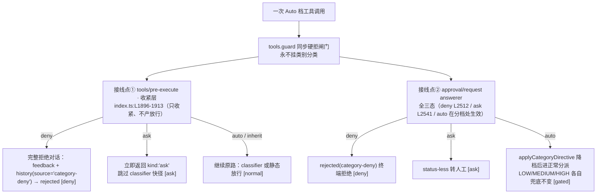

# 17 · 类别开关与信任目录
> *Tri-state category switches & trusted directories*

静态引擎（§03）回答「**这一次调用**危不危险」，类别层回答「**这一类操作**要不要问」。工具与 shell 命令被归入 11 个类别，每类可配 `auto / ask / deny` 三态；未配置 = `inherit`，行为与没有这层时完全一致。全部实现是纯函数（<span class="lnum">src/auto/category.ts</span>，647 行），宿主在两个接线点各自从零调用。

## 17.1　十一个类别与优先级 <span class="lnum">category.ts:L47-59</span>

| 优先级 | 类别 | 典型内容 | 配置约束 |
|---|---|---|---|
| 11 | `privilege` | sudo/su、set-executionpolicy 等提权 | <span class="badgeerr">LOCKED：仅可 ask</span>（开启 `privilegeAutoReview` 后三态可配） |
| 10 | `delete` | rm/del/Remove-Item 等删除 | <span class="badgeerr">LOCKED：仅可 ask</span> |
| 9 | `disk` | format/bcdedit/磁盘镜像写 | <span class="badgeerr">LOCKED：仅可 ask</span> |
| 8 | `protected` | 触碰受保护/关键路径的写改 | <span class="badgeerr">LOCKED：仅可 ask</span> |
| 7 | `networkExec` | curl/wget/iwr 外联下载执行 | 三态可配 |
| 6 | `gitPush` | git push 及等价远端变更 | 三态可配 |
| 5 | `publish` | npm publish/deploy 等发布动作 | 三态可配 |
| 4 | `gitLocal` | 本地 git 变更（commit/branch…） | 三态可配 |
| 3 | `fileEdit` | 工作区文件写改 | 三态可配 |
| 2 | `build` | 构建/测试/包管理例行命令 | 三态可配 |
| 1 | `readOnly` | 只读查询 | 三态可配 |

类别清单 `CATEGORY_KEYS`（L33-37）、锁定名单 `LOCKED_CATEGORIES = ['delete','protected','privilege','disk']`（L40）。另有 `harnessInternal` 与 `unknown` 两个非类别归宿：它们**没有配置键、恒为 inherit**（<span class="lnum">category.ts:L638</span>）——看不懂的东西不给你开自动。

## 17.2　三态语义

| 值 | 语义 | 关键边界 |
|---|---|---|
| `auto` | ≡ 按 LOW 档走，LLM 复审仍是最后一关 | 只对「本来就要进语义分类器」的调用生效（ask + classifierEligible，<span class="lnum">category.ts:L649-652</span>）；降档**不越 HIGH**——原判 HIGH/DENY 原地不动（<span class="lnum">category.ts:L695-697</span>） |
| `ask` | 无条件转人工；普通类别 = status-less 无倒计时；**LOCKED 类 = 恒拒倒计时**（默认 10s，超时自动拒绝，绝不因 timeoutAction 放行） | pre-execute 快径直接返回，LLM 分类器**永远没机会**回答一次类别 ask；answerer 侧 LOCKED 类带 `action:'reject'` 的 countdown status（index.ts:isLockedCategory 判定），普通类别仍直达无状态人工 |
| `deny` | 绝对拒绝，提权重试不可绕过 | 与 denyList 同构的终端拒绝（<span class="lnum">index.ts:L2512-2526</span>）；`applyCategoryDirective` 里 DENY 是地板，任何配置都压不住它（<span class="lnum">category.ts:L692</span>） |

## 17.3　双接点机制



两个接点各自调 `categoryDirectiveFor` 从零重算类别与指令，**无任何状态跨越**（函数注释明言，<span class="lnum">category.ts:L663-668</span>）；同一次调用被两层检查，但不存在「上层记住下层结论」的耦合。guard 层只做硬拒，从不参与类别判定。

## 17.4　LOCKED 类与三重保险（privilege 可解锁）

delete / protected / privilege / disk 四类在配置面上默认**只能收 `ask`**。保险有三道：

1. **schema 层**：`categoryPolicy` 的 zod 定义只允许 `auto|ask|deny` 三值字典（<span class="lnum">index.ts:L167</span>）；
2. **resolveConfig 层**：未知键 warn+丢弃，LOCKED 类别收到非 ask 值一律钳回丢弃并告警（<span class="lnum">index.ts:L199-217</span>）；
3. **决策层常量兜底**：即便有漏网配置进了运行时，`categoryDirective` 对 locked 类别的分支也只会给出 `ask` 或 `inherit`，绝无 auto/deny（<span class="lnum">category.ts:L643-646</span>）。

**例外：`privilegeAutoReview`（默认关，fail-closed）**。开启后 `privilege` 类别从 LOCKED 名单中剔除（delete / protected / disk 仍锁死）：配置面上 privilege 可设 auto/ask/deny，未配置时走 `inherit`——类别层不再强制转人，命令进入正常评审管线（classifier + LLM 评审 + 倒计时）。三层改动：schema 新键（<span class="lnum">index.ts:L190</span>）、resolveConfig 解锁分支（<span class="lnum">index.ts:L234</span>）、categoryDirective 解锁判定（<span class="lnum">category.ts:L642-647</span>）；client 设置卡「分类开关与信任模式」子卡新增同名开关（locale 键 `settings.category.privilegeAutoReview`），开启后 privilege 行的下拉才出现 自动/拒绝 选项。

**LOCKED 类的转人行为（2026-08-27 起）**：LOCKED 类（delete / protected / disk；privilege 未解锁时）的类别 ask **不再是 status-less**——answerer 注入硬拒倒计时（`action:'reject'` 恒拒、秒数取 `highRiskSeconds` 默认 10），无 LLM 接管 handle、无学习上下文；超时未响应自动 `timeout-deny`（agent 收到「no response: auto-rejected」），**任何 timeoutAction 配置都无法把它变成自动放行**。无人值守会话不再因危险命令无限挂起；面板上拒绝按钮带 10s 倒计时可直接点击。

## 17.5　复合命令：类别取先、指令取严

一条 bash 可能串了多段命令。`categorizeCommandSegments` 先做词法分解再逐段归类；**读不懂的整行（opaque）退化为单个 unknown 段**——不瞎判（<span class="lnum">category.ts:L605-615</span>）。合并规则 `mergeCommandDecisions`（<span class="lnum">category.ts:L582-598</span>）双轨取值：

- **类别取先**：按 §17.1 优先级表，最高优先级类别的标签胜出（`git push && rm x` 归 gitPush？不——delete 10 > gitPush 6，归 delete）;
- **directive 取严**：`deny > ask > auto > inherit`，任一段最严的指令决定整行待遇。

## 17.5b　写重定向与写向量族判类

- **写重定向目标参与判类**：含 `>`/`>>`/`>|`/`&>`/`N>` 写重定向（非 discard sink）的命令段按目标先行判类——命中敏感名/受保护路径 → `protected`，否则 → `fileEdit`，与显式写工具同语义；按 §17.1 优先级取严合并，delete/privilege 永不被拖低。
- **POSIX 写向量族五头**：`tee`、`dd of=`、`sed -i`（含后缀/--in-place 形态）、`truncate`、`install` 以操作数目标参与全部按目标闸门——直写运行态文件（history/audit 等）**无条件硬拒**，敏感/受保护目标与 cp/mv 同流；`sed` 不带 `-i`、`dd` 无 `of=` 保持读语义；`dd` 恒属 `disk` 锁定类。

## 17.6　信任目录模式 `categoryMode` 与敏感名熔丝

位置谓词 `isEffectiveRoutine(target, roots)`（<span class="lnum">category.ts:L140-145</span>）决定「工作区内的例行放行」认哪些地方：

| 模式 | 判定 |
|---|---|
| `standard`（默认） | workspace ∪ trustedDirs 内才认（<span class="lnum">category.ts:L143-144</span>） |
| `aggressive` | 直接 `return true`——位置不限（<span class="lnum">category.ts:L142</span>） |

aggressive 下三个内置类别 `['networkExec','gitPush','publish']`（`AGGRESSIVE_BUILTIN`，<span class="lnum">category.ts:L65</span>）在**未显式配置**时隐式取 `auto`（<span class="lnum">category.ts:L647</span>）——这就是「切激进会自动放行网络读写/git push/发布」的出处；显式配置过则听你的。

**危险度门全部不动**：敏感名熔丝 `sensitiveBasenameAt`（<span class="lnum">category.ts:L127-132</span>）对任意位置的 `.gitconfig/.netrc/.npmrc/.pypirc/.mcp.json/.bash*/.env(非 example)` 与 `.ssh/.gnupg/.aws/.azure/.kube` 目录段生效（名单 L110-120）——换什么模式都拦着；插件运行态文件硬拒、symlink realpath 复检同样与模式无关（§3.2/§3.4）。

## 17.7　trustedDirs 配置面

- **校验**：仅收绝对路径；凭据树（.ssh/.gnupg/.aws/.azure/.kube）、home、dshHome、critical 路径内的条目 warn+丢弃，余下归一化入库（resolveConfig，<span class="lnum">index.ts:L223-248</span>）。
- **host-only**：九员 host-only 键之一（<span class="lnum">decision.ts:L224-234</span>）——只能写在 settings.yaml / patch，设置卡保存不会抹掉它，也没有它的控件。
- **复检扩区**：symlink 守卫把 trustedDirs 并入受信复检区（workspace ∪ 插件区 ∪ trustedDirs，<span class="lnum">index.ts:L1827</span>）——文本上落进信任目录的目标照样做真实路径逃逸检查。

### 配置示例（默认零变化）

```yaml
auto-approval-llm:
  # 什么都不写 = 全部 inherit = 行为与本层不存在时一致
  # categoryPolicy: {}
  # categoryMode: standard
  # trustedDirs: []
  # ---- 以下为主动收紧/放宽的样子 ----
  categoryPolicy:
    fileEdit: auto      # 工作区文件写改：降为 LOW 档（仍送 LLM 复审）
    networkExec: ask    # 外联下载：无条件转人工
    gitLocal: deny      # 本地 git 变更：绝对拒绝
    # delete/protected/privilege/disk 写 auto/deny 会被 warn+丢弃，仅 ask 有效
  categoryMode: aggressive   # 取消位置白名单：任意位置视为常规位置（危险度门、敏感名 fuse 不动）
  trustedDirs:
    - D:\work\shared-lib     # 绝对路径；落在凭据树/home/critical 内会被丢弃
```
