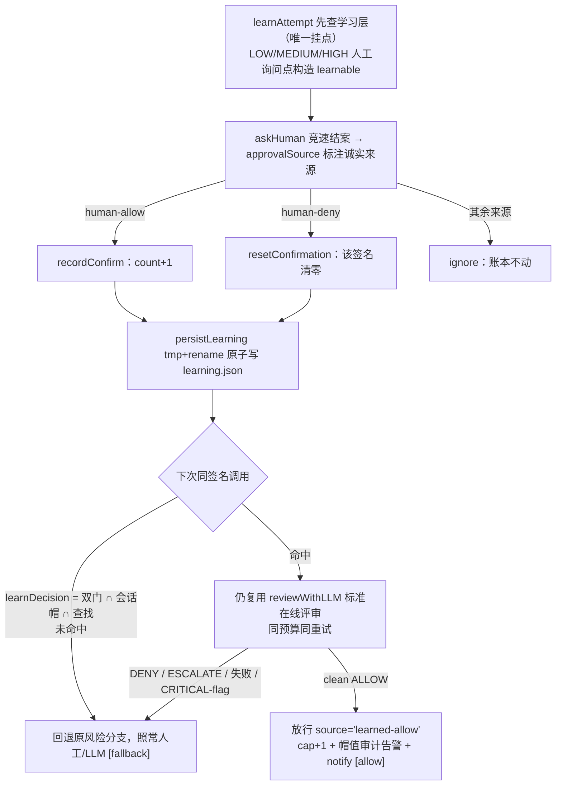

# 18 · 确认制学习
> *Confirmation learning*

一句话定位：**同一操作在 Auto 档被你反复人工确认之后，第 N 次起自动放行——且放行前仍要过一次标准在线评审**。默认关（`learningEnabled: false`），开了也只对「低危、非锁定类别、无熔丝命中」的窄域生效。

## 18.1　接线结构：先查学习层，人工询问点各带 learnable 记账

**学习层是决策序里的独立插槽**：`learnAttempt`（<span class="lnum">index.ts:L"const learnAttempt"</span>）只在一个接线点被调用——<span class="lnum">index.ts:L"const learnedAllow = await learnAttempt"</span>，位于策略层硬拒终端（policy-deny，<span class="lnum">index.ts:L"source: 'policy-deny'"</span>）**之后、LOW/MEDIUM/HIGH 人工管线之前**。静态引擎判死的东西根本走不到学习层；学习层能放行的，至多是本来就要弹窗问人的模糊区（见 §18.2）。

每个风险档的人工询问点都构造 learnable 上下文供记账（不直接碰账本，账本只由 `askHuman` 内的单汇聚点写）：

| 挂点 | 行号 | 场景 |
|---|---|---|
| LOW 无 LLM 评审 | <span class="lnum">index.ts:L"classified, 'low-countdown')"</span> | 倒计时人工（learnable tag `low-countdown`） |
| LOW + LLM 竞速 | <span class="lnum">index.ts:L"classified, 'low-llm-countdown')"</span> | 倒计时与异步复审并行（`low-llm-countdown`） |
| MEDIUM 无 LLM 评审 | <span class="lnum">index.ts:L"classified, 'medium-countdown')"</span> | 倒计时人工（`medium-countdown`） |
| MEDIUM + LLM 竞速 | <span class="lnum">index.ts:L"classified, 'medium-llm-countdown')"</span> | 竞速 + 异步复审并行（`medium-llm-countdown`） |
| HIGH | <span class="lnum">index.ts:L"classified, 'high-countdown')"</span> | 高风险倒计时（`high-countdown`） |
| 直接人工通道 | <span class="lnum">index.ts:L"const targetLearnable = learnableContextFor"</span> | `dsa_request_user` 目标签名（`direct-human-target`，人工授予时显式记账） |

计数/清零/持久化**单汇聚**于竞速结案与直接人工通道的两处记账点（<span class="lnum">index.ts:L"const action = confirmActionFor(source)"</span> 风险分档路径 / <span class="lnum">index.ts:L"learningMutex.run(targetLearnable.key, () =>"</span> 直接人工通道）：竞速结案后由 `approvalSource` 产出诚实来源，`confirmActionFor(source)` 定动作（<span class="lnum">learning.ts:LconfirmActionFor</span>）——`human-allow`→increment、`human-deny`→reset、**其余一切来源 ignore**；随后在 `learningMutex` 锁内 `resetConfirmation` / `recordConfirm` / `persistLearning`。其余 status-less 的转人路径（规则 human、humanOnly、类别 ask、manual、熔断等）不传 learnable，永不参与记账。`learnableContextFor` 是 learnable 的唯一生产者，熔丝判定在 `learningFuseHit`（<span class="lnum">index.ts:L"const learningFuseHit"</span>）。

## 18.2　插位安全性：硬拒不可被学习覆盖

`learnAttempt`（<span class="lnum">index.ts:L"const learnAttempt"</span>）的唯一调用行 <span class="lnum">index.ts:L"const learnedAllow = await learnAttempt"</span> 位于决策序的策略层 DENY 终端（policy-deny，<span class="lnum">index.ts:L"source: 'policy-deny'"</span>）**之后、风险分档人工管线之前**。接线顺序本身就是安全论证：声明式规则、denyList、类别 deny、静态 allow/ask、manual 模式、熔断跳闸、策略层硬拒——全部先于这一行回答完毕；凡是静态引擎判死的东西根本走不到学习层；学习层能放行的，至多是本来就要弹窗问人的模糊区。

## 18.3　可学域双门 `learnGateEligible` <span class="lnum">learning.ts:LlearnGateEligible</span>

```
enabled ∧ staticRisk ∈ {LOW, MEDIUM}          ← HIGH 永不学
        ∧ category 非 LOCKED 四类、非 harnessInternal（unknown 自 0.0.15 起可学）
        ∧ 无 fuse（风险名/理由正则或敏感路径命中，index.ts 的 learningFuseHit）
```



## 18.4　签名机制 `signatureFor` <span class="lnum">learning.ts:LsignatureFor</span>

学的是**确定性模板**，不是命令原文：

- shell 类按词法分解逐段出模板：头命令 + 子命令字面量 + 排序去重后的旗标名 + `<in:path>`/`<out:path>` 槽位（segmentTemplate，<span class="lnum">learning.ts:LsegmentTemplate</span>）；工具类是 `name(key:type,…)` 参数形状（toolTemplate，<span class="lnum">learning.ts:LtoolTemplate</span>）。同输入恒同输出，模板零原始值。
- **双向剪裁**：任一词 dynamic/glob/quoted、pwsh 冒号形参 `-Param:`、或头命令 ∈ {`tee`,`dd`,`sed`,`truncate`,`install`} ——任一命中整段即 undefined，**整行不学也不中**；整行再过字符白名单与 ≤512 长度复检。含变量的命令既进不了账本，也匹配不了账本。
- 落盘骨架先过 `redactSecrets`——账本里没有秘密。

## 18.5　存储：learning.json（六个运行态文件之一）

SHA-256(`sigVersion|kind|workspace|signature`) 作键（<span class="lnum">learning.ts:LlearningKey</span>）；条目 TTL 默认 30 天、全库上限 100 条、按 `lastAt` LRU 逐出（evictLearning，<span class="lnum">learning.ts:LevictLearning</span>）；同步 tmp+rename 原子替换（persistLearning，<span class="lnum">learning.ts:LpersistLearning</span>）。**工作区隔离**：查找要求条目的 workspace 与当前工作区精确相等（lookupLearning 门，<span class="lnum">learning.ts:LlookupLearning</span>）——A 项目攒下的确认资格带不到 B 项目。细节样例见 [§11.2](./11-data-persistence)。

## 18.6　消费闸：命中也要再过一次评审

`learnDecision = gate ∧ cap ∧ lookup`（<span class="lnum">learning.ts:LlearnDecision</span>）。命中后 `learnAttempt` **复用 `reviewWithLLM` 走标准在线评审**——同超时预算、同重试机制（<span class="lnum">index.ts:L"const { review, attempts } = await reviewWithLLM("</span>）；只要不是干净的 ALLOW，或评审结果带 CRITICAL 矛盾标记（`reviewerAutoAllowBlocked`），一律当未命中处理、滑回原风险分支（<span class="lnum">index.ts:L"if (review.decision !== 'ALLOW' || reviewerAutoAllowBlocked(review as any)) return undefined"</span>）。真正放行时：`breakerMutex` 锁内会话 cap+1（每根会话累计上限 50，`learningSessionAllowCap`）、恰达帽值的那一次放行（第 50 次）落一条 `learning-cap-reached` 审计告警（<span class="lnum">index.ts:L"type: 'learning-cap-reached'"</span>）、`notifyUser` 弹「✅ 已学习放行」提示（<span class="lnum">index.ts:L"✅ Learned allow for"</span>），history 记 `source:'learned-allow'`（<span class="lnum">index.ts:L"source: 'learned-allow'"</span>）。到帽后学习层休眠（`learningCapState`，<span class="lnum">learning.ts:LlearningCapState</span>），全部回人工。

## 18.7　配置与失效语义

| 项 | 默认 | 说明 |
|---|---|---|
| `learningEnabled` | **false** | 总开关，默认关是铁律：不开就没有任何行为差异 |
| `learningThreshold` | 3 | 所需人工确认次数 N；保存钳入 [2,10]（clampLearningThreshold，<span class="lnum">learning.ts:LclampLearningThreshold</span>），越界由 resolveConfig 发 warn（<span class="lnum">index.ts:L"clamping learningThreshold"</span>） |

设置卡「确认制学习」子卡两控件 + 七行说明文案（buildLearningBody <span class="lnum">client/index.ts:L"const buildLearningBody"</span>，注册 <span class="lnum">client/index.ts:L"subcard(t('settings.learning.title')"</span>；locale 中英各 12 键）。失效语义一句话：**任何一环不成立——开关关、类别锁定、熔丝命中、条目过期/损坏/跨工作区、到帽、评审不干净——都视同未命中，回到原有的人工/LLM 分支**。学习层只做减法路上的加速器，从不当裁判。

**条目查看与吊销（2026-08-27，backlog D 行 v2 落地）**：学习卡底部新增「已学习条目」区块——展开子卡时经 `/_dsh/auto-approval-llm/learning-store` GET 拉取只读列表（host 端把 entries 映射为 `{key,workspace,kind,skeleton,count,firstAt,lastAt}`，按 lastAt 倒序；key=哈希不泄露签名原文、skeleton=零原始值模板，无敏感信息过网）；每行展示 skeleton + 确认次数 + 「吊销」按钮，DELETE 单条（`{key}`）→ 串行化于同一 per-key mutex → `revokeLearning` 删条目 → `persistLearning` 原子落盘 → audit 追加 `learning-revoked` 留痕。未知 key 404；host 与 client 同源回环/白名单鉴权（与 history 路由同级）。契约锚：`revokeLearning` 纯函数 ×3 + 路由静态锚 ×6。
